# 第1章：理解大型语言模型

## 本章涵盖内容
*   对大型语言模型（LLM）背后基本概念的高层次解释
*   对类似ChatGPT的LLM所源自的Transformer架构的见解
*   从零开始构建LLM的计划

大型语言模型（LLM），例如OpenAI的ChatGPT所提供的模型，是过去几年中发展起来的深度神经网络模型。它们为自然语言处理（NLP）开创了一个新时代。

在大型语言模型出现之前，传统方法擅长处理分类任务，例如电子邮件垃圾邮件分类，以及可以通过手工规则或更简单模型捕获的直接模式识别。然而，在需要复杂理解和生成能力的语言任务中，它们通常表现不佳，例如解析详细指令、进行上下文分析，或创建连贯且符合上下文的原创文本。例如，前几代的语言模型无法根据关键词列表写一封电子邮件——而这对当代LLM来说却是微不足道的任务。

LLM具有理解、生成和解释人类语言的卓越能力。然而，需要明确的是，当我们说语言模型“理解”时，我们的意思是它们能够以看似连贯且与上下文相关的方式处理和生成文本，而不是它们拥有类似人类的意识或理解能力。

得益于深度学习的进步（深度学习是机器学习和人工智能的一个子集，专注于神经网络），LLM在海量文本数据上进行训练。这使得LLM能够比以往的方法捕捉到更深层次的上下文信息和人类语言的细微差别。因此，LLM在广泛的NLP任务中显著提高了性能，包括文本翻译、情感分析、问答等等。

当代LLM与早期NLP模型的另一个重要区别在于，后者通常是针对特定任务设计的；虽然那些早期的NLP模型在其狭窄的应用领域中表现出色，但LLM在广泛的NLP任务中展现出更全面的能力。

LLM的成功可以归因于作为许多LLM基石的Transformer架构，以及LLM训练所依赖的海量数据，这使得它们能够捕获各种语言上的细微差别、上下文和模式，而这些是难以手动编码的。

这种转向基于Transformer架构实现模型，并使用大型训练数据集来训练LLM的转变，从根本上改变了NLP，为理解和与人类语言交互提供了更强大的工具。

从本章开始，我们为实现本书的主要目标奠定基础：通过在代码中一步步实现一个基于Transformer架构的、类似ChatGPT的LLM，来深入理解LLM。

## 1.1 什么是LLM？

LLM，即大型语言模型，是一种旨在理解、生成和回应类人文本的神经网络。这些模型是深度神经网络，在海量文本数据上进行训练，有时甚至涵盖了互联网上公开可用文本的很大一部分。

LLM中的“大”既指模型在参数数量上的规模，也指其训练所用的海量数据集。这类模型通常拥有数百亿甚至数千亿个参数，这些参数是网络中可调整的权重，在训练过程中被优化，以预测序列中的下一个词。**预测下一个词**是一个合理的任务，因为它利用了语言固有的顺序性来训练模型理解文本中的上下文、结构和关系。然而，这是一个非常简单的任务，因此令许多研究人员惊讶的是，它竟然能产生能力如此强大的模型。我们将在后续章节中一步步讨论并实现这种下一个词的训练流程。

LLM利用一种称为 **Transformer** 的架构（将在1.4节更详细地介绍），这使得它们在做出预测时能够有选择地关注输入的不同部分，从而特别擅长处理人类语言的细微差别和复杂性。

由于LLM能够生成文本，它们也常被称为一种**生成式人工智能（AI）**，通常缩写为**生成式AI**或**GenAI**。如图1.1所示，AI涵盖了创造能够执行需要类人智能的任务（包括理解语言、识别模式和做出决策）的机器这一更广泛的领域，并包含了机器学习和深度学习等子领域。

**图1.1** 这幅层级图展示了不同领域之间的关系，表明LLM代表了深度学习技术的一种特定应用，利用了它们处理和生成类人文本的能力。深度学习是机器学习的一个专门分支，专注于使用多层神经网络。而机器学习和深度学习都旨在实现使计算机能够从数据中学习并执行通常需要人类智能的任务的算法。

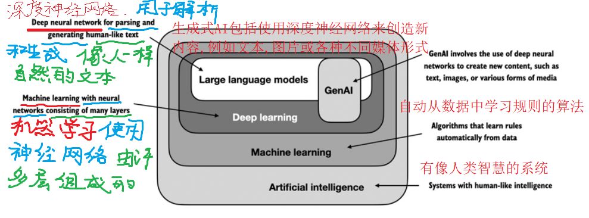

用于实现AI的算法是机器学习领域的焦点。具体来说，机器学习涉及开发能够从数据中学习，并基于数据进行预测或做出决策的算法，而无需进行显式编程。为了说明这一点，想象一下作为机器学习实际应用的**垃圾邮件过滤器**。不是手动编写规则来识别垃圾邮件，而是向机器学习算法提供标记为垃圾邮件和合法邮件的示例。通过最小化其在训练数据集上的预测误差，模型学会识别指示垃圾邮件的模式和特征，使其能够将新邮件分类为垃圾邮件或合法邮件。


如图1.1所示，**深度学习**是机器学习的一个子集，专注于利用具有三层或更多层的神经网络（也称为**深度神经网络**）来对数据中的复杂模式和抽象进行建模。与深度学习相比，传统机器学习需要**手动特征提取**。这意味着人类专家需要为模型识别和选择最相关的特征。

虽然当今的AI领域由机器学习和深度学习主导，但它也包括其他方法，例如使用基于规则的系统、遗传算法、专家系统、模糊逻辑或符号推理。

回到垃圾邮件分类的例子，在传统机器学习中，人类专家可能会手动从电子邮件文本中提取特征，例如某些触发词（“奖品”、“赢”、“免费”）的出现频率、感叹号的数量、全大写单词的使用，或可疑链接的存在。这个基于专家定义特征创建的数据集随后用于训练模型。与传统的机器学习相比，深度学习**不需要手动特征提取**。这意味着人类专家无需为深度学习模型识别和选择最相关的特征。（然而，在垃圾邮件分类的传统机器学习和深度学习中，你仍然需要收集标签，例如垃圾邮件或非垃圾邮件，这些标签需要由专家或用户收集。）

接下来的章节将介绍LLM现今可以解决的一些问题、LLM应对的挑战，以及我们将在本书中实现的通用LLM架构。

## 1.2 LLM的应用

由于LLM在解析和理解非结构化文本数据方面具有先进的能力，它们在各个领域都有广泛的应用。

如今，LLM被用于**机器翻译**、**生成新文本**（见图1.2）、**情感分析**、**文本摘要**以及许多其他任务。最近，LLM还被用于**内容创作**，例如撰写小说、文章，甚至计算机代码。

**图1.2** LLM接口实现了用户与AI系统之间的自然语言交流。这张截图展示了ChatGPT根据用户的特定要求写一首诗。

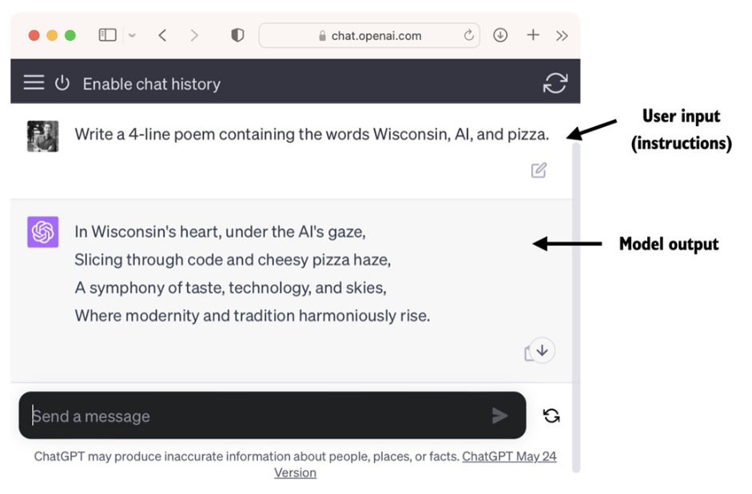

LLM还可以驱动复杂的**聊天机器人和虚拟助手**，例如OpenAI的ChatGPT或Google的Gemini（前身为Bard），它们可以回答用户的查询，并增强传统的搜索引擎，如Google Search或Microsoft Bing。

此外，LLM可用于从医学或法律等专业领域的大量文本中进行**高效的知识检索**。这包括筛选文档、总结长篇段落以及回答技术性问题。

简而言之，LLM对于自动化几乎任何涉及解析和生成文本的任务都**非常宝贵**。它们的应用几乎是无穷无尽的，随着我们不断创新和探索使用这些模型的新方法，很明显，LLM有潜力重新定义我们与技术的关系，使其更加对话式、直观和易于使用。

在本书中，我们将专注于**从头开始理解LLM的工作原理**，编写一个能够生成文本的LLM。我们还将学习一些技术，使LLM能够执行各种查询，从回答问题到总结文本、将文本翻译成不同语言等等。换句话说，在本书中，我们将通过一步步构建一个复杂的LLM助手（如ChatGPT）来学习它的工作原理。

## 1.3 构建和使用LLM的阶段

我们为什么要自己构建LLM？**从头开始编写LLM是理解其工作机制和局限性的绝佳练习**。同时，它也能让我们掌握必要的知识，以便对现有的开源LLM架构进行预训练或微调，使其适应我们自己特定领域的数据集或任务。

研究表明，在建模性能方面，**为特定任务或领域定制的LLM，可以超越像ChatGPT这样为广泛用途而设计的通用LLM**。这方面的例子包括专门用于金融领域的BloombergGPT，以及为医学问答量身定制的LLM（更多详情请见附录B的“延伸阅读与参考文献”部分）。

创建LLM的一般过程包括**预训练**和**微调**两个阶段。“预训练”中的“预”指的是初始阶段，此时像LLM这样的模型在一个大型、多样化的数据集上进行训练，以发展对语言的广泛理解。这个预训练模型随后作为一个基础资源，可以通过微调进一步完善。微调是一个过程，模型在一个更窄的、针对特定任务或领域的数据集上进行专门训练。这种包含预训练和微调的两阶段训练方法如图1.3所示。

**图1.3** 对LLM进行预训练涉及在大型文本数据集上进行下一个词的预测。然后，可以使用较小的标记数据集对预训练的LLM进行微调。
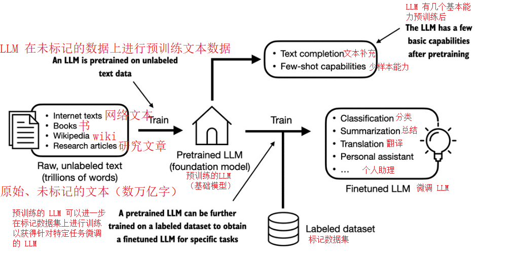

如图1.3所示，创建LLM的第一步是在一个大型文本语料库上对其进行训练，这些文本有时被称为**原始文本**。这里的“原始”指的是这些数据只是普通的文本，没有任何标注信息[1]。（可能会应用一些过滤，例如移除格式字符或未知语言的文档。）

LLM这第一个训练阶段也被称为**预训练**，它创建了一个初始的预训练LLM，通常被称为**基础模型**或**基座模型**。这类模型的一个典型例子是GPT-3模型（ChatGPT中最初模型的前身）。这个模型能够进行**文本补全**，即完成用户提供的半句话。它还具备有限的**少样本能力**，这意味着它只需基于几个示例就能学会执行新任务，而不需要大量的训练数据。下一节“为不同任务使用Transformer”将进一步说明这一点。

在用大型文本数据集训练得到预训练LLM（LLM被训练来预测文本中的下一个词）之后，我们可以在带标签的数据上进一步训练LLM，这一步称为**微调**。

最流行的两类LLM微调包括**指令微调**和**分类任务微调**。在指令微调中，标记数据集由“指令-答案”对组成，例如一个“翻译这段文本”的查询，伴随的就是正确翻译后的文本。在分类微调中，标记数据集由文本和相应的类别标签组成，例如带有“垃圾邮件”和“非垃圾邮件”标签的电子邮件。

在本书中，我们将涵盖LLM预训练和微调的代码实现。在完成基础LLM的预训练之后，我们将在本书后面更深入地探讨指令微调和分类微调的细节。

## 1.4 为不同任务使用LLM

大多数现代LLM都依赖于**Transformer架构**，这是一种深度神经网络架构，由2017年的论文《注意力是你所需要的一切》提出。为了理解LLM，我们有必要简要了解一下最初的Transformer，它最初是为机器翻译（将英语文本翻译成德语和法语）而开发的。图1.4展示了Transformer架构的简化版本。

**图1.4** 原始Transformer架构的简化图，这是一种用于语言翻译的深度学习模型。Transformer由两部分组成：一个**编码器**，负责处理输入文本并生成文本的嵌入表示（一种在不同维度捕捉多种因素的数值表示）；一个**解码器**，利用这种表示逐词生成翻译后的文本。注意，此图展示了翻译过程的最终阶段，此时给定原始输入文本（"This is an example"）和部分翻译的句子（"Das ist ein"），解码器只需生成最后一个词（"Beispiel"）即可完成翻译。

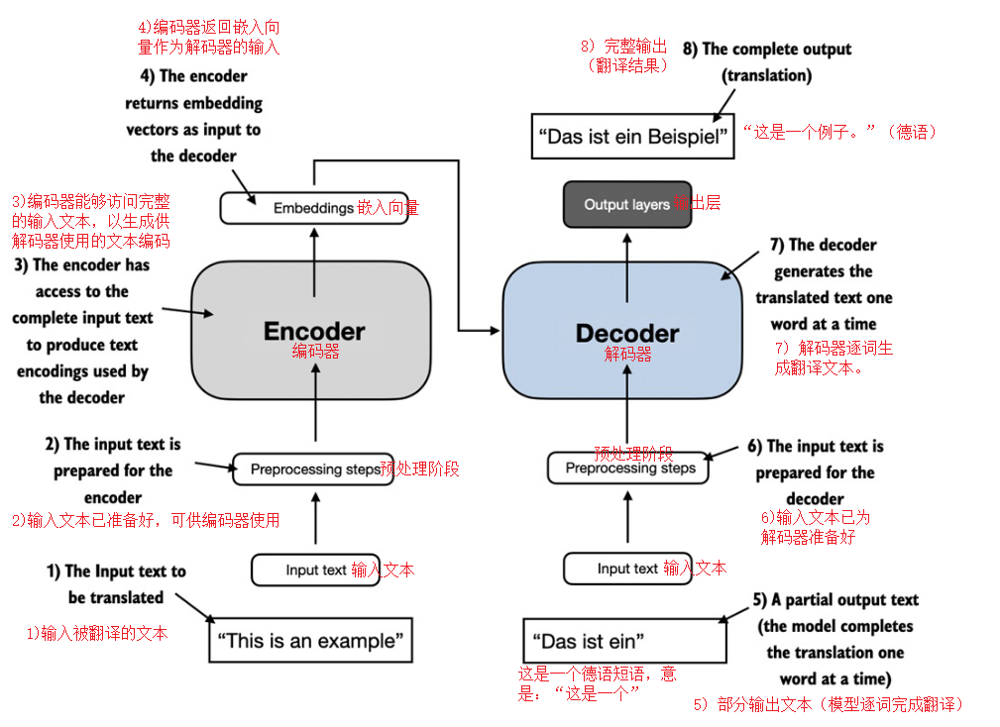

图1.4描绘的Transformer架构包含两个子模块：**编码器**和**解码器**。编码器模块处理输入文本，并将其编码成一系列捕捉输入上下文信息的数值表示（或称为向量）。然后，解码器模块接收这些编码后的向量，并从中生成输出文本。例如，在翻译任务中，编码器会将源语言的文本编码成向量，解码器则将这些向量解码，生成目标语言的文本。编码器和解码器都由许多层组成，这些层通过所谓的**自注意力机制**连接。关于输入如何预处理和编码，你可能会有很多疑问，这些将在后续章节的逐步实现中得到解答。

Transformer和LLM的一个关键组件是**自注意力机制**（图中未显示），它允许模型权衡序列中不同词语（或标记）之间的相对重要性。这种机制使模型能够捕捉输入数据中的长距离依赖关系和上下文联系，从而增强其生成连贯且上下文相关的输出的能力。然而，由于其复杂性，我们将把解释推迟到第3章，在那里我们将一步步讨论并实现它。此外，我们将在第2章“处理文本数据”中讨论并实现创建模型输入所需的数据预处理步骤。

后来的Transformer架构变体，例如**BERT（来自Transformer的双向编码器表示）**和各类**GPT模型（生成式预训练Transformer）**，都是建立在这个概念之上，以使这种架构适应不同的任务。（参考文献见附录B。）

BERT建立在原始Transformer编码器子模块之上，其训练方法与GPT不同。GPT是为生成式任务而设计的，而BERT及其变体则专注于**掩码词预测**，即模型预测给定句子中被掩盖或隐藏的词语，如图1.5所示。这种独特的训练策略使BERT在文本分类任务（包括情感预测和文档分类）中表现出色。截至撰写本文时，Twitter正使用BERT来检测有害内容。

**图1.5** Transformer编码器和解码器子模块的可视化表示。左侧，编码器部分代表了类似BERT的LLM，它们专注于掩码词预测，主要用于文本分类等任务。右侧，解码器部分展示了类似GPT的LLM，它们专为生成式任务设计，用于生成连贯的文本序列。

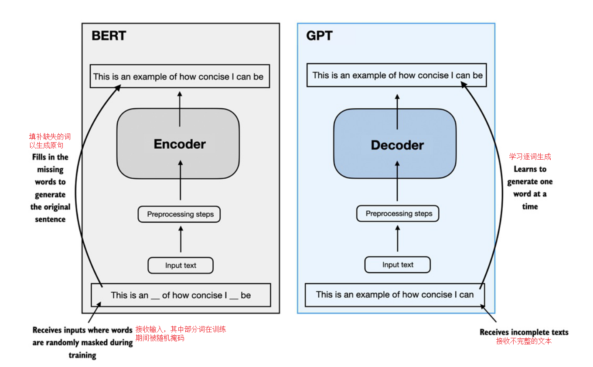

另一方面，GPT专注于原始Transformer架构中的**解码器部分**，专为需要生成文本的任务而设计，这包括机器翻译、文本摘要、小说创作、编写计算机代码等等。我们将在本章剩余部分更详细地讨论GPT架构，并在本书中从头实现它。

GPT模型虽然主要设计和训练用于执行文本补全任务，但也展现出惊人的多才多艺。这些模型擅长执行**零样本**和**少样本**学习任务。零样本学习指的是无需任何先前的具体示例，就能泛化到完全未见过的任务的能力。另一方面，少样本学习涉及从用户提供的极少量示例中进行学习，如图1.6所示。

**图1.6** 除了文本补全，类似GPT的LLM可以基于输入解决各种任务，而无需重新训练、微调或更改特定任务的模型架构。有时，在输入中提供目标的示例会有所帮助，这被称为**少样本**设置。然而，类似GPT的LLM也能在没有特定示例的情况下执行任务，这被称为**零样本**设置。

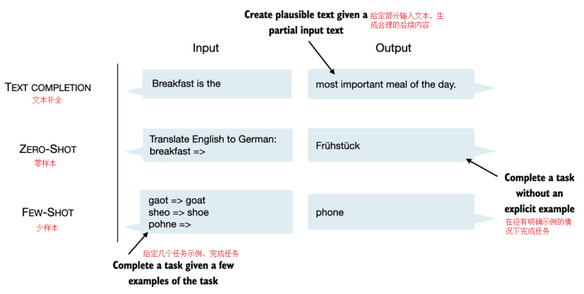

> **Transformer 与 LLM**
> 当今的LLM都是基于上一节介绍的Transformer架构。因此，在文献中，Transformer和LLM这两个术语经常被互换使用。然而，请注意，并非所有Transformer都是LLM，因为Transformer也可用于计算机视觉。另外，也不是所有LLM都是基于Transformer的，因为还存在基于循环和卷积架构的大型语言模型。这些替代方法的主要动机是提高LLM的计算效率。然而，这些替代的LLM架构是否能与基于Transformer的LLM的能力相抗衡，以及它们是否会被实际采用，仍有待观察。（感兴趣的读者可以在本章末尾的“延伸阅读”部分找到描述这些架构的参考文献。）
## 1.5 利用大型数据集

流行的类GPT和类BERT模型的大型训练数据集是多样且全面的文本语料库，包含数十亿个词，涵盖了广泛的主题以及自然语言和计算机语言。举一个具体的例子，表1.1总结了用于预训练GPT-3（作为第一版ChatGPT的基础模型）的数据集。

**表1.1 流行的GPT-3 LLM的预训练数据集**

| 数据集名称 | 数据集描述 | 令牌数量 | 在训练数据中的比例 |
|---|---|---|---|
| CommonCrawl (已过滤) | 网络爬虫数据 | 4100亿 | 60% |
| WebText2 | 网络爬虫数据 | 190亿 | 22% |
| Books1 | 基于互联网的书籍语料库 | 120亿 | 8% |
| Books2 | 基于互联网的书籍语料库 | 550亿 | 8% |
| Wikipedia | 高质量文本 | 30亿 | 3% |

表1.1报告了**令牌数量**，其中**令牌**是模型读取的文本单位，数据集中的令牌数量大致相当于文本中单词和标点符号的数量。我们将在下一章更详细地介绍**分词**（将文本转换为令牌的过程）。

主要的结论是，这个训练数据集的规模和多样性使得这些模型能够在各种任务上表现良好，包括理解语言语法、语义、上下文，甚至一些需要通用知识的任务。

> **GPT-3数据集细节**
> 在表1.1中，需要注意的是，每个数据集中只有一部分数据（总计3000亿个令牌）被用于训练过程。这种采样方法意味着训练并未涵盖每个数据集中的每一部分可用数据。相反，它使用了从所有数据集组合中抽取的、总计3000亿个令牌的选定子集。同时，虽然某些数据集并未完全包含在这个子集中，但其他数据集可能会被多次包含以达到3000亿个令牌的总数。表中列出的比例，如果忽略舍入误差，总和为100%，正是针对这个采样子集而言的。
> 作为背景参考，CommonCrawl数据集本身就包含4100亿个令牌，需要约570 GB的存储空间。相比之下，像Meta的LLaMA这样的GPT-3后续模型，已经将其训练范围扩大到包括Arxiv研究论文（92 GB）和StackExchange的代码相关问答（78 GB）等额外数据源。
> Wikipedia语料库由英文维基百科组成。虽然GPT-3论文的作者没有进一步说明细节，但Books1很可能来自Project Gutenberg的样本，而Books2可能来自Libgen。CommonCrawl是CommonCrawl数据库的过滤子集，而WebText2则是Reddit上获得3个以上投票的帖子中所有外部链接指向网页的文本。
> GPT-3论文的作者没有共享训练数据集，但一个可公开访问的类似数据集是The Pile。然而，该集合可能包含受版权保护的作品，其确切的使用条款可能取决于预期的用例和国家/地区。更多信息，请参见HackerNews的讨论。

这些模型的“预训练”特性使它们在针对下游任务进行进一步微调时极具通用性，这就是为什么它们也被称为**基础模型**或**基座模型**。预训练LLM需要访问大量计算资源，且非常昂贵。例如，估计GPT-3的预训练成本在云计算信用额度方面高达460万美元[2]。

好消息是，许多预训练的LLM作为开源模型可用，可以作为通用工具来编写、提取和编辑不属于训练数据的文本。此外，LLM可以针对特定任务使用相对较小的数据集进行微调，从而减少所需的计算资源并提高在该特定任务上的性能。

在本书中，我们将为实现预训练编写代码，并出于教育目的使用它来预训练一个LLM。所有的计算都将在消费级硬件上可执行。在实现预训练代码之后，我们将学习如何重用公开可用的模型权重，并将它们加载到我们将要实现的架构中，这样在我们本书后面微调LLM时，就可以跳过昂贵的预训练阶段。
## 1.6 深入探究GPT架构

在本章前面，我们提到了类GPT模型、GPT-3和ChatGPT这些术语。现在让我们更仔细地看看通用的GPT架构。

首先，**GPT**代表**生成式预训练Transformer（Generative Pretrained Transformer）**，最初是在以下论文中提出的：

*   **《通过生成式预训练提升语言理解》** (2018)
    *   作者：OpenAI的Radford等人
    *   链接：http://cdn.openai.com/research-covers/language-unsupervised/language_understanding_paper.pdf

**GPT-3**是这个模型的放大版，拥有更多参数，并在更大的数据集上进行了训练。而ChatGPT中提供的原始模型是通过使用OpenAI的InstructGPT论文中的方法，在一个大型指令数据集上对GPT-3进行微调而创建的，我们将在第7章“通过人类反馈进行微调以遵循指令”中更详细地介绍这种方法。

正如我们之前在**图1.6**中看到的，这些模型是称职的文本补全模型，并且可以执行其他任务，如拼写纠正、分类或语言翻译。考虑到GPT模型是在一个相对简单的**下一个词预测任务**上进行预训练的，这实际上非常了不起，如图1.7所示。

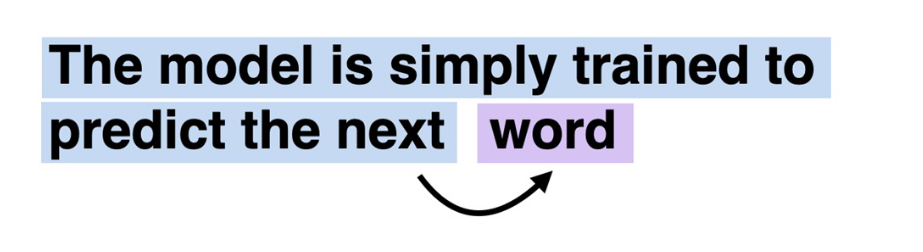

**图1.7** 在GPT模型的下一个词预训练任务中，系统通过查看句子中前面的词来学习预测下一个词。这种方法帮助模型理解单词和短语在语言中通常如何组合在一起，形成了可以应用于各种其他任务的基础。

下一个词预测任务是一种**自监督学习**的形式，也就是一种**自我标记**的形式。这意味着我们不需要显式地为训练数据收集标签，而是可以利用数据本身的结构：我们可以将句子或文档中的下一个词作为模型应该预测的标签。由于这种下一个词预测任务允许我们“即时”创建标签，因此可以利用海量的未标记文本数据集来训练LLM，正如前面 **1.5节“利用大型数据集”** 所讨论的那样。

与我们在**1.4节“为不同任务使用LLM”**中介绍的原始Transformer架构相比，通用的GPT架构相对简单。本质上，它只是去掉了编码器的解码器部分，如图1.8所示。由于像GPT这样的解码器风格模型通过一次一个词地预测来生成文本，因此它们被视为一种**自回归模型**。自回归模型将其先前的输出作为未来预测的输入。因此，在GPT中，每个新词都是基于它前面的序列来选择的，这提高了生成文本的连贯性。

像GPT-3这样的架构也比最初的Transformer模型大得多。例如，最初的Transformer将编码器和解码器模块重复了六次。而GPT-3拥有**96个Transformer层**和总计**1750亿个参数**。

**图1.8** GPT架构仅使用原始Transformer的解码器部分。它专为单向、从左到右的处理而设计，非常适合文本生成和下一个词预测任务，能够以迭代的方式一次一个词地生成文本。

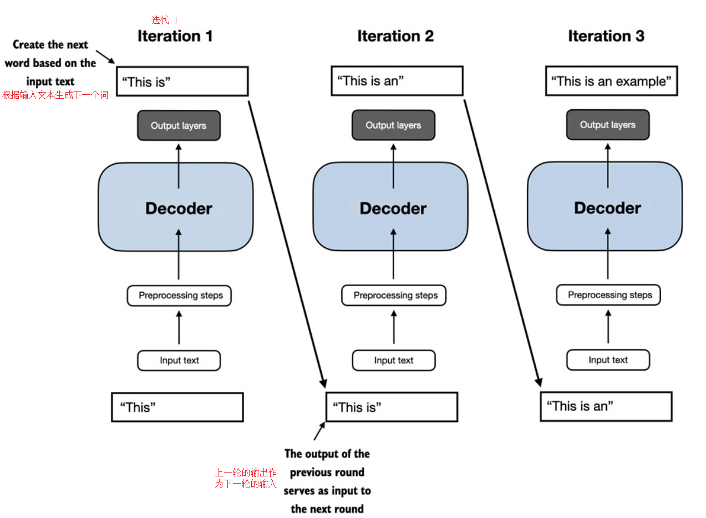

GPT-3于2020年推出，按照深度学习和LLM发展的标准来看，这已经算是很久以前了。然而，较新的架构，如Meta的Llama模型，仍然基于相同的基本概念，只引入了微小的修改。因此，理解GPT仍然和以往一样重要。本书专注于实现GPT背后的这种主流架构，同时也会指出其他LLM采用的一些具体调整。

最后，有趣的是，尽管最初的Transformer模型是专门为语言翻译而设计的，但GPT模型——尽管其目标为下一个词预测的架构更大但更简单——也具备执行翻译任务的能力。这种能力最初对研究人员来说是意料之外的，因为它从一个主要训练用于下一个词预测任务（一个并非专门针对翻译的任务）的模型中涌现出来。

执行模型并未被明确训练过的任务的能力被称为**涌现行为**。这种能力并非在训练过程中明确教授，而是作为模型暴露于大量多语言数据于多样上下文中的自然结果而涌现出来的。GPT模型即使没有经过专门训练也能“学会”语言之间的翻译模式并执行翻译任务，这一事实证明了这些大规模生成式语言模型的好处和能力。我们可以执行多样的任务，而无需为每个任务使用不同的模型。

## 1.7 构建大型语言模型

在本章中，我们为理解LLM奠定了基础。在本书的其余部分，我们将**从零开始编写一个LLM**。我们将以GPT背后的基本思想为蓝图，分三个阶段进行，如图1.9所示。

**图1.9** 本书涵盖的构建LLM的阶段包括：实现LLM架构和数据准备过程，预训练LLM以创建基础模型，以及微调基础模型使其成为个人助手或文本分类器。

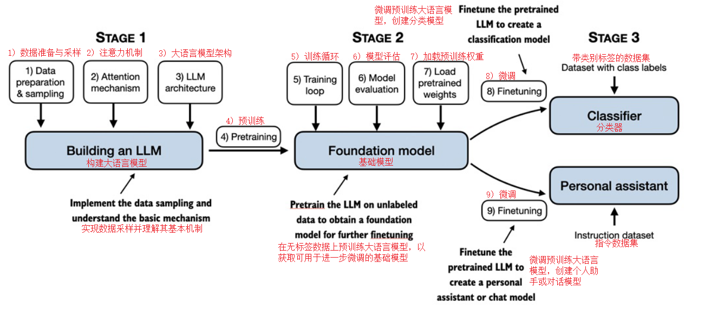

*   **第一阶段**，我们将学习基础的数据预处理步骤，并编写作为每个LLM核心的**注意力机制**的代码。
*   接下来，在**第二阶段**，我们将学习如何编写并预训练一个能够生成新文本的、类似GPT的LLM。我们还将探讨评估LLM的基本原理，这对于开发有能力的NLP系统至关重要。
    *   请注意，从头开始预训练一个大型LLM是一项巨大的工程，对于类似GPT的模型，计算成本需要数千到数百万美元。因此，第二阶段的重点是使用小型数据集，**出于教育目的实现训练过程**。此外，本书还将提供用于加载公开可用的模型权重的代码示例。
*   最后，在**第三阶段**，我们将获取一个预训练的LLM，并对其进行微调，使其能够**遵循指令**，例如回答问题或对文本进行分类——这是许多现实世界应用和研究中最常见的任务。

我希望你期待着踏上这段激动人心的旅程！

## 1.8 本章小结

*   LLM彻底改变了自然语言处理领域，而此前该领域主要依赖基于显式规则的系统或更简单的统计方法。LLM的出现引入了由深度学习驱动的新方法，推动了在理解、生成和翻译人类语言方面的进步。
*   现代LLM的训练主要分为两步。
    *   首先，它们在一个大规模的未标记文本语料库上进行**预训练**，利用预测句子中下一个词作为“标签”。
    *   然后，它们在一个较小的、有标记的目标数据集上进行**微调**，以学习遵循指令或执行分类任务。
*   LLM基于Transformer架构。该架构的核心思想是**注意力机制**，它使得LLM在逐词生成输出时，可以有选择性地访问整个输入序列。
*   最初的Transformer架构由一个用于解析文本的**编码器**和一个用于生成文本的**解码器**组成。
*   用于生成文本和遵循指令的LLM（例如GPT-3和ChatGPT）**只实现了解码器模块**，从而简化了架构。
*   由数十亿个词组成的大型数据集对于LLM的预训练至关重要。在本书中，出于教育目的，我们将在小型数据集上实现并训练LLM，但同时也会学习如何加载公开可用的模型权重。
*   虽然类GPT模型的一般预训练任务是预测句子中的下一个词，但这些LLM展现出了一些**涌现特性**，例如分类、翻译或总结文本的能力。
*   LLM一旦完成预训练，得到的基础模型就可以针对各种下游任务进行更高效的微调。
*   在自定义数据集上微调后的LLM，在特定任务上的表现可以超越通用LLM。

---
[1] 具有机器学习背景的读者可能会注意到，标记信息通常是传统机器学习模型和通过常规监督学习范式训练的深度神经网络所必需的。然而，LLM的预训练阶段并非如此。在此阶段，LLM利用了自监督学习，模型会从输入数据中自行生成标签。本章后面会介绍这个概念。

[2] GPT-3, The $4,600,000 Language Model，链接：https://www.reddit.com/r/MachineLearning/comments/h0jwoz/d_gpt3_the_460 (注：原书脚注链接指向Reddit讨论帖，由于网站限制，当前无法直接访问其内容。)

# 第2章：处理文本数据

## 本章涵盖内容
*   为大型语言模型训练准备文本
*   将文本分割成词和子词令牌
*   字节对编码作为一种更高级的文本分词方法
*   使用滑动窗口方法采样训练示例
*   将令牌转换为输入大型语言模型的向量

在上一章中，我们深入探讨了大型语言模型的一般结构，并了解到它们是在海量文本上进行预训练的。具体来说，我们重点关注了基于Transformer架构的**仅解码器LLM**，这是ChatGPT和其他流行的类GPT模型所使用的基础模型。

在预训练阶段，LLM一次处理一个词。使用下一个词预测任务训练具有数百万到数十亿参数的LLM，会产生具有令人印象深刻的能力的模型。然后可以对这些模型进行进一步的微调，以遵循一般指令或执行特定的目标任务。但在我们能够在接下来的章节中实现和训练LLM之前，我们需要准备好训练数据集，这正是本章的重点，如图2.1所示。

**图2.1** 编码LLM的三个主要阶段的思维模型：在通用文本数据集上预训练LLM，以及在标记数据集上对其进行微调。本章将解释并编写数据准备和采样流程，为LLM提供预训练所需的文本数据。

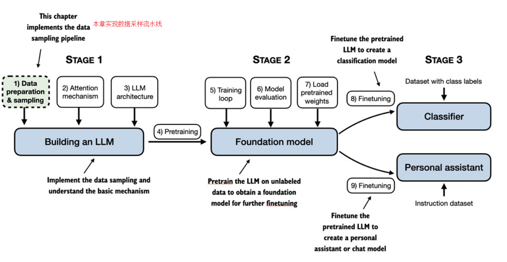

在本章中，你将学习如何为训练LLM准备输入文本。这包括将文本分割成单个的词和子词令牌，然后可以将它们编码为LLM可以处理的向量表示。你还将了解像**字节对编码**这样的高级分词方案，它被用于像GPT这样的流行LLM中。最后，我们将实现一种采样和数据加载策略，以生成后续章节中训练LLM所必需的输入-输出对。

## 2.1 理解词嵌入

深度神经网络模型，包括LLM，不能直接处理原始文本。由于文本是分类的，它与用于实现和训练神经网络的数学运算不兼容。因此，我们需要一种将词表示为**连续值向量**的方法。（不熟悉计算上下文中向量和张量的读者可以在附录A的A2.2节“理解张量”中了解更多。）

将数据转换为向量格式的概念通常被称为**嵌入**。使用特定的神经网络层或另一个预训练的神经网络模型，我们可以嵌入不同类型的数据，例如视频、音频和文本，如图2.2所示。

**图2.2** 深度学习模型无法处理原始形式的视频、音频和文本等数据格式。因此，我们使用一个嵌入模型将这些原始数据转换为深度架构可以轻松理解和处理的**密集向量表示**。具体来说，此图说明了将原始数据转换为三维数值向量的过程。

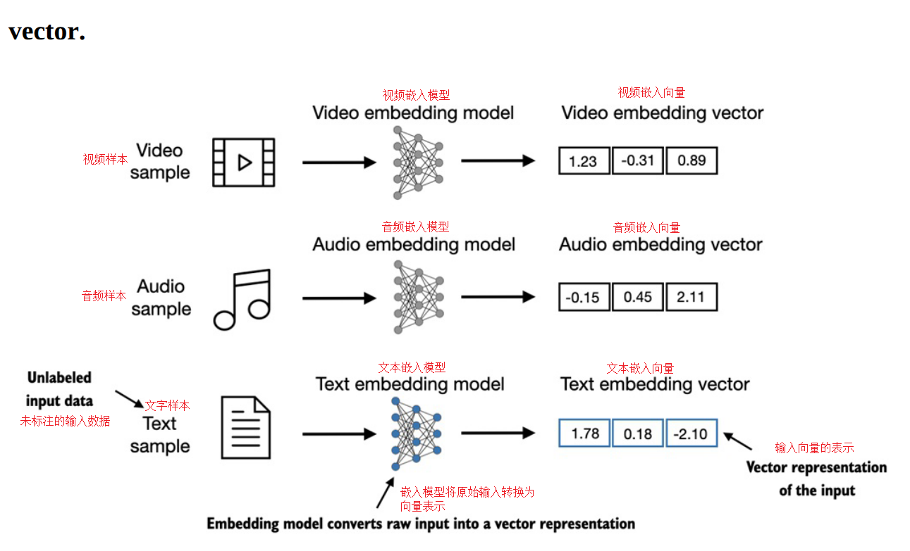

如图2.2所示，我们可以通过嵌入模型处理各种不同的数据格式。然而，重要的是要注意，不同的数据格式需要不同的嵌入模型。例如，为文本设计的嵌入模型将不适合嵌入音频或视频数据。

从核心上讲，嵌入是一种从离散对象（例如词、图像，甚至整个文档）到连续向量空间中的点的映射——嵌入的主要目的是将非数值数据转换为神经网络可以处理的格式。

虽然**词嵌入**是最常见的文本嵌入形式，但也有针对句子、段落或整个文档的嵌入。句子或段落嵌入是检索增强生成的流行选择。检索增强生成结合了生成（如产生文本）和检索（如搜索外部知识库），以便在生成文本时提取相关信息，这是一种超出本书范围的技术。由于我们的目标是训练类似GPT的LLM，它们学习一次生成一个词，因此本章重点介绍词嵌入。

有几种算法和框架已被开发用于生成词嵌入。较早且最流行的例子之一是**Word2Vec**方法。Word2Vec训练神经网络架构，通过根据目标词预测词的上下文（或反之）来生成词嵌入。Word2Vec背后的主要思想是，出现在相似上下文中的词往往具有相似的含义。因此，当为了可视化目的将二维词嵌入投影出来时，可以看到相似的术语聚集在一起，如图2.3所示。

**图2.3** 如果词嵌入是二维的，我们可以将它们绘制在二维散点图中进行可视化，如此处所示。当使用像Word2Vec这样的词嵌入技术时，对应相似概念的词在嵌入空间中通常彼此靠近出现。例如，不同类型的鸟类在嵌入空间中彼此之间的距离，比它们与国家或城市之间的距离更近。

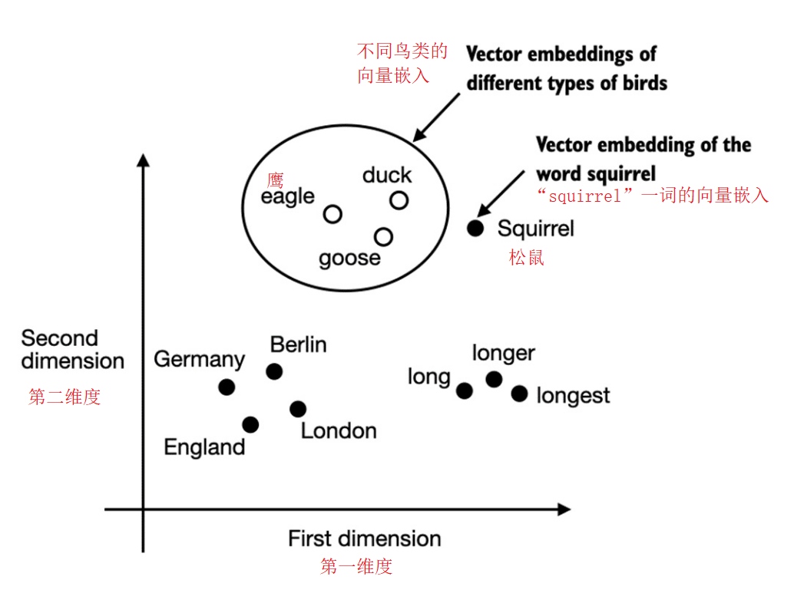

词嵌入可以有不同的维度，从一到数千。如图2.3所示，我们可以选择二维词嵌入用于可视化目的。更高的维度可能会捕捉到更微妙的关系，但代价是计算效率。

虽然我们可以使用像Word2Vec这样的预训练模型为机器学习模型生成嵌入，但LLM通常会产生自己的嵌入，这些嵌入是输入层的一部分，并在训练期间更新。与使用Word2Vec相比，将嵌入作为LLM训练的一部分进行优化的优势在于，这些嵌入是针对手头的特定任务和数据进行了优化的。我们将在本章后面实现这样的嵌入层。此外，LLM还可以创建上下文相关的输出嵌入，我们将在第3章中讨论。

不幸的是，高维嵌入给可视化带来了挑战，因为我们的感官知觉和常见的图形表示本质上限于三维或更少，这就是为什么图2.3在二维散点图中显示了二维嵌入。然而，当使用LLM时，我们通常使用比图2.3中所示维度高得多的嵌入。对于GPT-2和GPT-3，嵌入大小（通常称为模型隐藏状态的维度）根据特定的模型变体和大小而变化。这是性能和效率之间的权衡。最小的GPT-2模型（1.17亿和1.25亿参数）使用768维的嵌入大小作为具体例子。最大的GPT-3模型（1750亿参数）使用12,288维的嵌入大小。

本章接下来的部分将逐步介绍准备LLM使用的嵌入所需的步骤，其中包括将文本分割成词、将词转换为令牌，以及将令牌转换为嵌入向量。
## 2.2 分词

本节介绍如何将输入文本分割成单个的**令牌**，这是为LLM创建嵌入所必需的预处理步骤。这些令牌可以是单个的词，也可以是包括标点符号在内的特殊字符，如图2.4所示。

**图2.4** 在LLM上下文中，本节所涵盖的文本处理步骤概览。这里，我们将输入文本分割成单个令牌，这些令牌可以是词或特殊字符（如标点符号）。在接下来的章节中，我们将把文本转换为令牌ID并创建令牌嵌入。

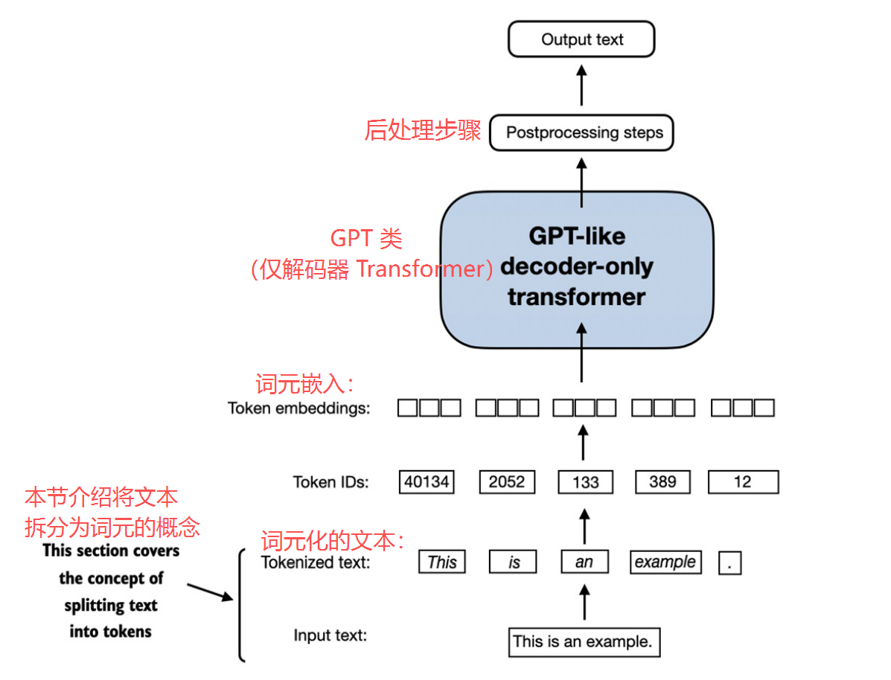

我们将用于LLM训练的分词文本是伊迪丝·华顿（Edith Wharton）的一篇短篇小说，名为《The Verdict》。该小说已进入公共领域，因此可用于LLM训练任务。文本可在维基文库上获取，你可以将其复制并粘贴到一个文本文件中。我将它复制到了一个名为 `"the-verdict.txt"` 的文件中，以便使用Python的标准文件读取工具加载：

**代码清单 2.1 将短篇小说作为文本样本读入 Python**
```python
with open("the-verdict.txt", "r", encoding="utf-8") as f:
    raw_text = f.read()
print("Total number of character:", len(raw_text))
print(raw_text[:99])
```
或者，你也可以在本书的GitHub仓库中找到这个 `"the-verdict.txt"` 文件。

`print` 命令会输出文件的总字符数，然后是文件的前100个字符，以便说明情况：
```
Total number of character: 20479
I HAD always thought Jack Gisburn rather a cheap genius--though a good fellow enough--so it was no
```
我们的目标是将这篇20,479个字符的短篇故事分词成单个的词和特殊字符，以便在接下来的章节中将其转换为LLM训练所需的嵌入。

> **关于文本样本大小的说明**
> 请注意，在处理LLM时，通常会处理数百万篇文章和数十万本书籍——即许多吉字节的文本。然而，出于教育目的，使用像单本书这样的小型文本来阐明文本处理步骤背后的主要思想就足够了，并且可以在消费级硬件上在合理的时间内运行。

我们怎样才能最好地分割这段文本以获得令牌列表呢？为此，我们先进行一点小的探索，并使用Python的正则表达式库 `re` 进行说明。（注意，你不必学习或记忆任何正则表达式语法，因为本章稍后我们将过渡到一个预构建的分词器。）

使用一些简单的示例文本，我们可以使用 `re.split` 命令配合以下语法，根据空白字符分割文本：
```python
import re
text = "Hello, world. This, is a test."
result = re.split(r'(\s)', text)
print(result)
```
结果是一个包含单个词、空格和标点符号的列表：
```
['Hello,', ' ', 'world.', ' ', 'This,', ' ', 'is', ' ', 'a', ' ', 'test.']
```
请注意，上述简单的分词方案对于将示例文本分割成单个词基本有效，但是，有些词仍然与标点符号连在一起，而我们希望这些标点符号作为单独的列表项。我们也没有将所有文本转为小写，因为大小写有助于LLM区分专有名词和普通名词、理解句子结构，并学习生成具有正确大小写的文本。

让我们修改正则表达式，使其在空白符 (`\s`) 以及逗号和句号 (`[,.]`) 上进行分割：
```python
result = re.split(r'([,.]|\s)', text)
print(result)
```
我们可以看到，现在单词和标点符号正如我们想要的那样，成为了单独的列表项：
```
['Hello', ',', '', ' ', 'world', '.', '', ' ', 'This', ',', '', ' ', 'is', ' ', 'a', ' ', 'test', '.', '']
```
一个小问题是列表中仍然包含空白字符。我们可以选择安全地移除这些多余的字符，如下所示：
```python
result = [item for item in result if item.strip()]
print(result)
```
移除空白后的输出如下：
```
['Hello', ',', 'world', '.', 'This', ',', 'is', 'a', 'test', '.']
```

> **关于是否移除空白符**
> 在开发一个简单的分词器时，是将空白符编码为单独的字符还是直接移除，取决于我们的应用及其要求。移除空白符可以减少内存和计算需求。然而，如果我们训练的模型对文本的确切结构敏感（例如，对缩进和空格敏感的Python代码），那么保留空白符可能很有用。这里，为了简化分词输出，我们移除了空白符。稍后，我们将切换到一种包含空白符的分词方案。

我们上面设计的分词方案在简单示例文本上效果很好。让我们再稍微修改一下，使其能够处理其他类型的标点符号，例如问号、引号，以及我们在伊迪丝·华顿短篇小说前100个字符中看到的双破折号，以及其他特殊字符：
```python
text = "Hello, world. Is this-- a test?"
result = re.split(r'([,.:;?_!"()\']|--|\s)', text)
result = [item.strip() for item in result if item.strip()]
print(result)
```
得到的输出如下：
```
['Hello', ',', 'world', '.', 'Is', 'this', '--', 'a', 'test', '?']
```
如图2.5所示，我们的分词方案现在可以成功地处理文本中的各种特殊字符了。

**图2.5** 我们目前实现的分词方案将文本分割成单个词和标点字符。在这个图所示的特定示例中，示例文本被分割成了10个单独的令牌。

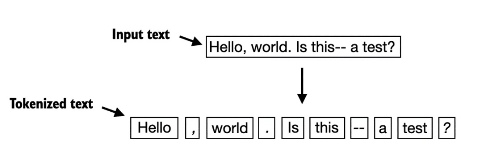

既然我们已经有了一个可以工作的基本分词器，让我们将其应用于伊迪丝·华顿的整个短篇小说：
```python
preprocessed = re.split(r'([,.?_!"()\']|--|\s)', raw_text)
preprocessed = [item.strip() for item in preprocessed if item.strip()]
print(len(preprocessed))
```
上面的 `print` 语句输出 `4649`，这是这篇文本中（不含空白符）的令牌数量。

让我们打印前30个令牌进行快速的可视化检查：
```python
print(preprocessed[:30])
```
结果显示我们的分词器似乎处理得很好，因为所有单词和特殊字符都被整齐地分开了：
```
['I', 'HAD', 'always', 'thought', 'Jack', 'Gisburn', 'rather', 'a'
```
## 2.3 将令牌转换为令牌ID

在上一节中，我们将伊迪丝·华顿的一篇短篇小说分词成了单个的令牌。在本节中，我们将把这些令牌从Python字符串转换为整数表示，以生成所谓的**令牌ID**。这种转换是将令牌ID转换为嵌入向量之前的一个中间步骤。

为了将之前生成的令牌映射到令牌ID，我们首先需要构建一个所谓的**词表**。这个词表定义了如何将每个独特的词和特殊字符映射到一个唯一的整数，如图2.6所示。

**图2.6** 我们通过对训练数据集中的整个文本进行分词，将其分割成单个令牌来构建词表。然后对这些单个令牌按字母顺序排序，并移除重复的令牌。这些独特的令牌随后被聚合到一个词表中，该词表定义了从每个独特令牌到唯一整数值的映射。图中描绘的词表特意做得很小以作说明，并且为简单起见，不包含标点符号或特殊字符。

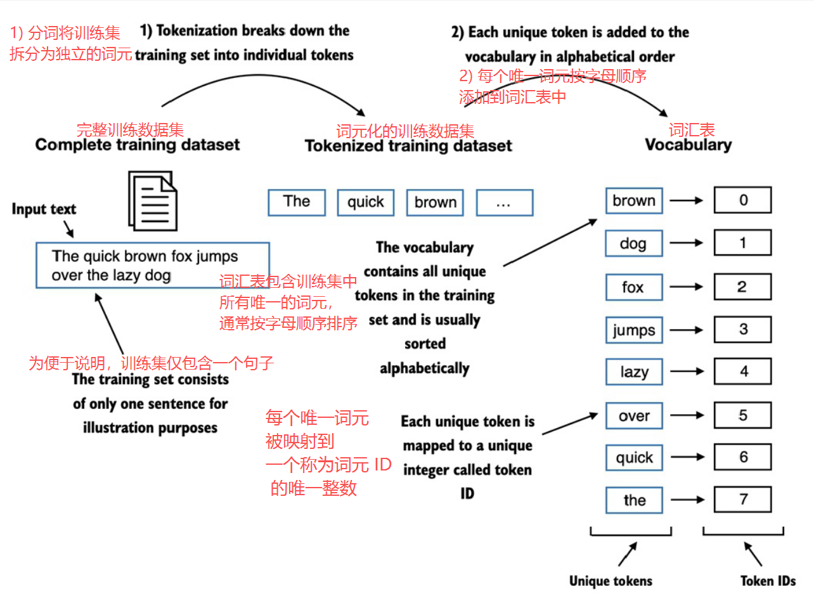

在上一节中，我们对伊迪丝·华顿的短篇小说进行了分词，并将其赋值给一个名为 `preprocessed` 的Python变量。现在，让我们创建一个包含所有独特令牌的列表，并按字母顺序排序，以确定词表大小：
```python
all_words = sorted(list(set(preprocessed)))
vocab_size = len(all_words)
print(vocab_size)
```
通过上述代码确定词表大小为 1,159 后，我们创建词表并打印其前50个条目以供说明：

**代码清单 2.2 创建词表**
```python
vocab = {token:integer for integer,token in enumerate(all_words)}
for i, item in enumerate(vocab.items()):
    print(item)
    if i > 50:
        break
```
```
('!', 0)
('"', 1)
("'", 2)
...
('Has', 49)
('He', 50)
```
正如我们在上面的输出中看到的，该字典包含了与唯一整数标签相关联的单个令牌。我们的下一个目标是应用这个词表将新文本转换为令牌ID，如图2.7所示。

**图2.7** 从一个新的文本样本开始，我们对其进行分词，并使用词表将文本令牌转换为令牌ID。词表是从整个训练集构建的，既可以应用于训练集本身，也可以应用于任何新的文本样本。为简单起见，图中描绘的词表不包含标点符号或特殊字符。


在本书后面，当我们需要将LLM的输出从数字转换回文本时，我们还需要一种将令牌ID转换为文本的方法。为此，我们可以创建一个词表的逆版本，将令牌ID映射回相应的文本令牌。

让我们在Python中实现一个完整的**分词器类**，其中包含一个 `encode` 方法，用于将文本分割成令牌，并通过词表执行字符串到整数的映射以生成令牌ID。此外，我们还实现一个 `decode` 方法，用于执行反向的整数到字符串的映射，将令牌ID转换回文本。

这个分词器实现的代码如下（代码清单 2.3）：

**代码清单 2.3 实现一个简单的文本分词器**
```python
class SimpleTokenizerV1:
    def __init__(self, vocab):
        self.str_to_int = vocab  #A
        self.int_to_str = {i:s for s,i in vocab.items()}  #B
    
    def encode(self, text):  #C
        preprocessed = re.split(r'([,.?_!"()\']|--|\s)', text)
        preprocessed = [item.strip() for item in preprocessed if item.strip()]
        ids = [self.str_to_int[s] for s in preprocessed]
        return ids
        
    def decode(self, ids):  #D
        text = " ".join([self.int_to_str[i] for i in ids]) 
        #E 修复空格与标点符号之间的空格
        text = re.sub(r'\s+([,.?!"()\'])', r'\1', text)
        return text
```
使用上面的 `SimpleTokenizerV1` Python类，我们现在可以通过现有的词表实例化新的分词器对象，然后使用它对文本进行编码和解码，如图2.8所示。

**图2.8** 分词器实现共享两个常见方法：`encode` 方法和 `decode` 方法。`encode` 方法接收示例文本，将其分割成单个令牌，并通过词表将令牌转换为令牌ID。`decode` 方法接收令牌ID，将它们转换回文本令牌，并将文本令牌连接成自然文本。

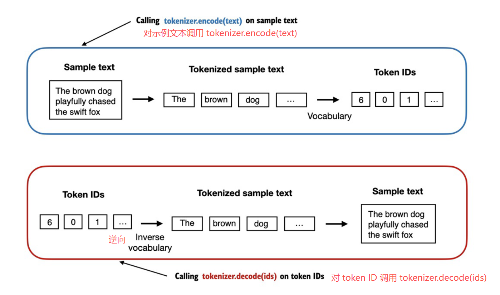

让我们从 `SimpleTokenizerV1` 类实例化一个新的分词器对象，并对伊迪丝·华顿短篇小说中的一段文字进行分词，以进行实际测试：
```python
tokenizer = SimpleTokenizerV1(vocab)
 
text = """"It's the last he painted, you know," Mrs. Gisburn said with pardonable pride."""
ids = tokenizer.encode(text)
print(ids)
```
上面的代码打印出以下令牌ID：
```
[1, 58, 2, 872, 1013, 615, 541, 763, 5, 1155, 608, 5, 1, 69, 7, 39, 873, 1136, 773, 812, 7]
```
接下来，让我们看看是否可以使用 `decode` 方法将这些令牌ID转换回文本：
```python
print(tokenizer.decode(ids))
```
这会输出以下文本：
```
'" It\' s the last he painted, you know," Mrs. Gisburn said with pardonable pride.'
```
从上面的输出可以看出，`decode` 方法成功地将令牌ID转换回了原始文本。

到目前为止，一切顺利。我们实现了一个能够基于训练集中的片段对文本进行分词和去分词的标记器。现在，让我们将其应用于一个训练集中未包含的新文本样本：
```python
text = "Hello, do you like tea?"
tokenizer.encode(text)
```
执行上述代码将导致以下错误：
```
...
KeyError: 'Hello'
```
问题在于单词 "Hello" 没有出现在《The Verdict》短篇小说中。因此，它不包含在词表中。这突出了一个事实，即在处理LLM时，需要考虑**大型且多样化的训练集**来扩展词表。

在下一节中，我们将进一步在包含未知词的文本上测试分词器，并且还将讨论可用于在训练期间为LLM提供更多上下文的特殊令牌。

## 2.4 添加特殊上下文令牌

在上一节中，我们实现了一个简单的分词器，并将其应用于训练集中的一个段落。在本节中，我们将修改这个分词器，使其能够处理未知词。

我们还将讨论特殊上下文令牌的用法和添加，这些令牌可以增强模型对文本中上下文或其他相关信息的理解。这些特殊令牌可以包括，例如，未知词标记和文档边界标记。

具体来说，我们将修改上一节中实现的分词器（`SimpleTokenizerV2`），使其支持两个新令牌：`<|unk|>` 和 `<|endoftext|>`，如图2.9所示。

**图2.9** 我们向词表中添加特殊令牌以处理特定上下文。例如，我们添加一个 `<|unk|>` 令牌来表示不属于训练数据、因此也不在现有词表中的新词和未知词。此外，我们添加一个 `<|endoftext|>` 令牌，可用于分隔两个不相关的文本源。

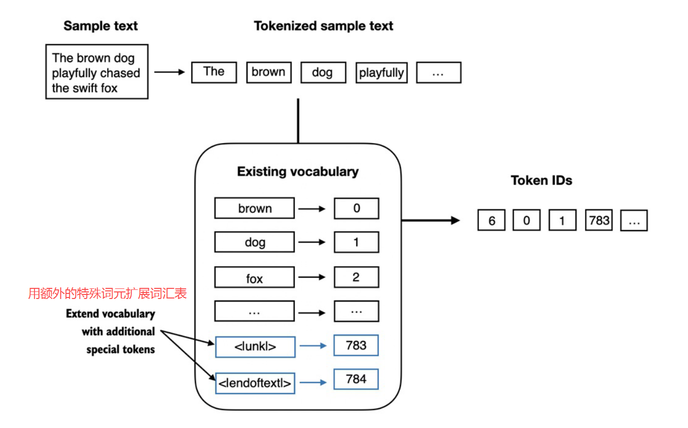

如图2.9所示，如果遇到不在词表中的词，我们可以修改分词器使其使用 `<|unk|>` 令牌。此外，我们还在不相关的文本之间添加一个令牌。例如，在多个独立文档或书籍上训练类似GPT的LLM时，常见做法是在每个文档或书籍（跟在之前的文本源之后）之前插入一个令牌，如图2.10所示。这有助于LLM理解，尽管这些文本源为了训练而被连接在一起，但它们实际上是不相关的。

**图2.10** 在处理多个独立的文本源时，我们在这些文本之间添加 `<|endoftext|>` 令牌。这些 `<|endoftext|>` 令牌作为标记，指示特定片段的开始或结束，使得LLM能够更有效地处理和理解。

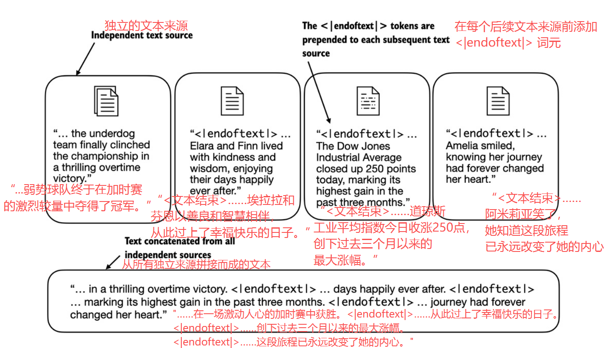

现在，让我们修改词表，将这两个特殊令牌 `<unk>` 和 `<|endoftext|>` 包含进去，将它们添加到我们在上一节中创建的所有独特词的列表中：
```python
all_tokens = sorted(list(set(preprocessed)))
all_tokens.extend(["<|endoftext|>", "<|unk|>"])
vocab = {token:integer for integer,token in enumerate(all_tokens)}
 
print(len(vocab.items()))
```
根据上面 `print` 语句的输出，新的词表大小为 1161（上一节的词表大小为 1159）。

作为额外的快速检查，让我们打印更新后词表的最后5个条目：
```python
for i, item in enumerate(list(vocab.items())[-5:]):
    print(item)
```
上面的代码输出：
```
('younger', 1156)
('your', 1157)
('yourself', 1158)
('<|endoftext|>', 1159)
('<|unk|>', 1160)
```
根据上面的代码输出，我们可以确认这两个新的特殊令牌确实已成功纳入词表。接下来，我们相应地调整代码清单2.3中的分词器，如代码清单2.4所示：

**代码清单2.4 一个能够处理未知词的简单文本分词器**
```python
class SimpleTokenizerV2:
    def __init__(self, vocab):
        self.str_to_int = vocab
        self.int_to_str = { i:s for s,i in vocab.items()}
    
    def encode(self, text):
        preprocessed = re.split(r'([,.?_!"()\']|--|\s)', text)
        preprocessed = [item.strip() for item in preprocessed if item.strip()]
        preprocessed = [item if item in self.str_to_int   #A
                        else "<|unk|>" for item in preprocessed]
 
        ids = [self.str_to_int[s] for s in preprocessed]
        return ids
        
    def decode(self, ids):
        text = " ".join([self.int_to_str[i] for i in ids])
 
        text = re.sub(r'\s+([,.?!"()\'])', r'\1', text)   #B
        return text
```
与我们在上一节代码清单2.3中实现的 `SimpleTokenizerV1` 相比，新的 `SimpleTokenizerV2` 将未知词替换为 `<|unk|>` 令牌。

现在让我们在实际中尝试这个新的分词器。为此，我们将使用一个简单的文本样本，该样本由两个独立且不相关的句子连接而成：
```python
text1 = "Hello, do you like tea?"
text2 = "In the sunlit terraces of the palace."
text = " <|endoftext|> ".join((text1, text2))
print(text)
```
输出如下：
```
'Hello, do you like tea? <|endoftext|> In the sunlit terraces of the palace.'
```
接下来，让我们使用我们在代码清单2.2中创建的词表，通过 `SimpleTokenizerV2` 对样本文本进行分词：
```python
tokenizer = SimpleTokenizerV2(vocab)
print(tokenizer.encode(text))
```
这将打印出以下令牌ID：
```
[1160, 5, 362, 1155, 642, 1000, 10, 1159, 57, 1013, 981, 1009, 738, 1013, 1160, 7]
```
在上面，我们可以看到令牌ID列表包含了分隔符 `<|endoftext|>` 的ID `1159`，以及两个用于未知词的ID `1160`。

让我们对文本进行去分词，以快速检查：
```python
print(tokenizer.decode(tokenizer.encode(text)))
```
输出如下：
```
'<|unk|>, do you like tea? <|endoftext|> In the sunlit terraces of the <|unk|>.'
```
通过比较上面的去分词文本与原始输入文本，我们知道训练数据集（伊迪丝·华顿的短篇小说《The Verdict》）不包含单词 "Hello" 和 "palace"。

到目前为止，我们已经讨论了分词作为将文本处理为LLM输入的关键步骤。根据LLM的不同，一些研究人员还会考虑额外的特殊令牌，例如：
*   **[BOS] (序列开始)**：此令牌标记文本的开始。它向LLM指示内容从哪里开始。
*   **[EOS] (序列结束)**：此令牌位于文本的末尾，在连接多个不相关的文本时特别有用，类似于 `<|endoftext|>`。例如，当合并两篇不同的维基百科文章或书籍时，`[EOS]` 令牌指示一篇文章的结束和下一篇文章的开始。
*   **[PAD] (填充)**：当使用大于1的批量大小训练LLM时，批量中的文本可能长度不一。为了确保所有文本具有相同的长度，较短的文本会使用 `[PAD]` 令牌进行扩展或“填充”，直到达到批量中最长文本的长度。

请注意，用于GPT模型的分词器不需要上述任何令牌，为简单起见，它只使用一个 `<|endoftext|>` 令牌。`<|endoftext|>` 类似于上面提到的 `[EOS]` 令牌。同时，`<|endoftext|>` 也用于填充。然而，正如我们将在后续章节中探讨的，在对批量输入进行训练时，我们通常会使用掩码，这意味着我们不关注填充的令牌。因此，选择哪个特定令牌进行填充就变得无关紧要了。

此外，用于GPT模型的分词器也不为词汇表外的词使用 `<|unk|>` 令牌。相反，GPT模型使用一种字节对编码分词器，它将单词分解为子词单元，我们将在下一节中讨论。

## 2.5 字节对编码

在前面的章节中，我们为了说明目的实现了一个简单的分词方案。本节将介绍一种基于**字节对编码**概念的更复杂的分词方案。本节介绍的BPE分词器被用于训练LLM，例如GPT-2、GPT-3以及ChatGPT中使用的原始模型。

由于实现BPE可能相对复杂，我们将使用一个现有的Python开源库，名为`tiktoken`，它基于Rust源代码非常高效地实现了BPE算法。与其他Python库类似，我们可以通过终端使用Python的pip安装器来安装`tiktoken`库：
```bash
pip install tiktoken
```
本章的代码基于`tiktoken 0.5.1`版本。你可以使用以下代码检查当前安装的版本：
```python
from importlib.metadata import version
import tiktoken
print("tiktoken version:", version("tiktoken"))
```
安装完成后，我们可以按如下方式实例化来自`tiktoken`的BPE分词器：
```python
tokenizer = tiktoken.get_encoding("gpt2")
```
这个分词器的用法与我们之前通过`encode`方法实现的`SimpleTokenizerV2`类似：
```python
text = "Hello, do you like tea? <|endoftext|> In the sunlit terraces of someunknownPlace."
integers = tokenizer.encode(text, allowed_special={"<|endoftext|>"})
print(integers)
```
上面的代码打印出以下令牌ID：
```
[15496, 11, 466, 345, 588, 8887, 30, 220, 50256, 554, 262, 4252, 18250, 8812, 2114, 286, 617, 34680, 27271, 13]
```
然后我们可以使用`decode`方法将令牌ID转换回文本，与我们之前的`SimpleTokenizerV2`类似：
```python
strings = tokenizer.decode(integers)
print(strings)
```
上述代码打印出以下内容：
```
'Hello, do you like tea? <|endoftext|> In the sunlit terraces of someunknownPlace.'
```
基于上面的令牌ID和解码文本，我们可以注意到两点。首先，`<|endoftext|>`令牌被分配了一个相对较大的令牌ID，即50256。事实上，用于训练GPT-2、GPT-3以及ChatGPT原始模型的BPE分词器，总词表大小为50,257，其中`<|endoftext|>`被分配了最大的令牌ID。

其次，上面的BPE分词器正确地编码和解码了未知词，例如"someunknownPlace"。BPE分词器可以处理任何未知词。它如何在不使用`<|unk|>`令牌的情况下实现这一点呢？

BPE的底层算法将不在其预定义词表中的单词分解成更小的子词单元甚至单个字符，从而使其能够处理词汇表外的词。因此，得益于BPE算法，如果分词器在分词过程中遇到一个不熟悉的词，它可以将其表示为一个子词令牌或字符的序列，如图2.11所示。

**图2.11** BPE分词器将未知词分解为子词和单个字符。这样，BPE分词器可以解析任何单词，并且无需用`<|unk|>`等特殊令牌替换未知词。

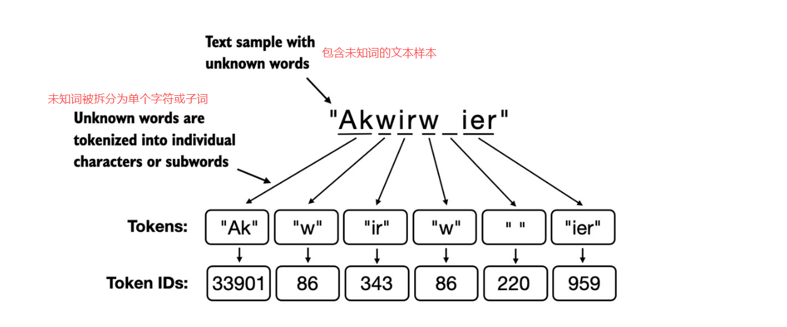

如图2.11所示，将未知词分解为单个字符的能力确保了分词器，以及使用它训练的LLM，可以处理任何文本，即使其中包含训练数据中未出现的单词。

**练习 2.1 未知词的字节对编码**
尝试使用`tiktoken`库中的BPE分词器处理未知词"Akwirw ier"，并打印单个令牌ID。然后，对结果列表中的每个整数调用`decode`函数，以复现图2.11中所示的映射。最后，对令牌ID调用`decode`方法，检查它是否能重构原始输入"Akwirw ier"。

对BPE的详细讨论和实现超出了本书的范围，但简而言之，它通过迭代地将频繁出现的字符合并为子词，以及将频繁出现的子词合并为词来构建其词表。例如，BPE首先将所有单个字符添加到其词表中（"a"、"b"……）。在下一阶段，它将经常一起出现的字符组合合并为子词。例如，"d"和"e"可能被合并为子词"de"，这在许多英语单词中很常见，如"define"、"depend"、"made"和"hidden"。合并操作由频率阈值决定。

## 2.6 使用滑动窗口进行数据采样

前一节详细介绍了分词步骤以及从字符串令牌转换为整数令牌ID的过程。在最终为LLM创建嵌入之前，下一步是生成训练LLM所需的**输入-目标对**。

这些输入-目标对是什么样的？正如我们在第1章中学到的，LLM通过预测文本中的下一个词来进行预训练，如图2.12所示。

**图2.12** 给定一个文本样本，提取输入块作为LLM的子样本，LLM在训练期间的预测任务是预测输入块之后的下一个词。在训练期间，我们屏蔽掉目标之后的所有词。请注意，此图中显示的文本在LLM处理之前需要经过分词；但为了清晰起见，此图省略了分词步骤。

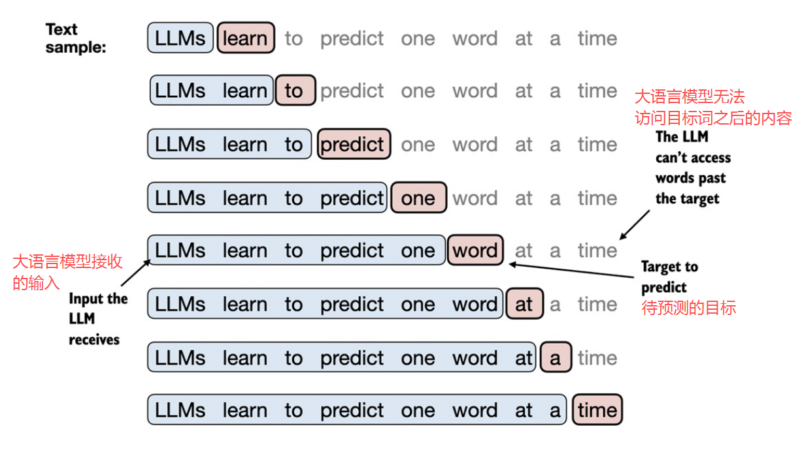

在本节中，我们将实现一个**数据加载器**，使用**滑动窗口**方法从训练数据集中获取图2.12所示的输入-目标对。

首先，我们将使用上一节介绍的BPE分词器对之前处理的短篇小说《The Verdict》的整个文本进行分词：
```python
with open("the-verdict.txt", "r", encoding="utf-8") as f:
    raw_text = f.read()
 
enc_text = tokenizer.encode(raw_text)
print(len(enc_text))
```
执行上述代码将返回5145，这是应用BPE分词器后训练集中的总令牌数。

接下来，为了演示目的，我们从数据集中移除前50个令牌，因为这将在后续步骤中产生一个稍微有趣的文本段落：
```python
enc_sample = enc_text[50:]
```

为下一个词预测任务创建输入-目标对的最简单、最直观的方法之一是创建两个变量 `x` 和 `y`，其中 `x` 包含输入令牌，`y` 包含目标，即输入向右偏移一位：
```python
context_size = 4  #A
x = enc_sample[:context_size]
y = enc_sample[1:context_size+1]
print(f"x: {x}")
print(f"y:      {y}")
```
运行上述代码将打印以下输出：
```
x: [290, 4920, 2241, 287]
y:      [4920, 2241, 287, 257]
```
处理输入及其目标（即向右偏移一位的输入）后，我们可以创建如图2.12所示的下一个词预测任务，如下所示：
```python
for i in range(1, context_size+1):
    context = enc_sample[:i]
    desired = enc_sample[i]
    print(context, "---->", desired)
```
上面的代码打印出以下内容：
```
[290] ----> 4920
[290, 4920] ----> 2241
[290, 4920, 2241] ----> 287
[290, 4920, 2241, 287] ----> 257
```
箭头左侧指的是LLM将接收的输入，箭头右侧的令牌ID是LLM应该预测的目标令牌ID。

为了说明，让我们重复之前的代码，但将令牌ID转换为文本：
```python
for i in range(1, context_size+1):
    context = enc_sample[:i]
    desired = enc_sample[i]
    print(tokenizer.decode(context), "---->", tokenizer.decode([desired]))
```
以下输出显示了输入和输出的文本格式：
```
 and ---->  established
 and established ---->  himself
 and established himself ---->  in
 and established himself in ---->  a
```

我们现在已经创建了输入-目标对，可以在接下来的章节中将其用于LLM训练。

正如我们在本章开头提到的，在将令牌转换为嵌入之前，还有一项任务：实现一个高效的数据加载器，它迭代输入数据集，并将输入和目标作为**PyTorch张量**返回，张量可以理解为多维数组。

具体来说，我们感兴趣的是返回两个张量：一个包含LLM看到的文本的输入张量，以及一个包含LLM需要预测的目标的目标张量，如图2.13所示。

**图2.13** 为了实现高效的数据加载器，我们将输入收集到一个张量 `x` 中，其中每一行代表一个输入上下文。第二个张量 `y` 包含相应的预测目标（下一个词），它是通过将输入向右移动一位创建的。


虽然图2.13为了说明目的显示了字符串格式的令牌，但代码实现将直接操作令牌ID，因为BPE分词器的 `encode` 方法将分词和转换为令牌ID作为一步完成。

对于高效的数据加载器实现，我们将使用PyTorch内置的 `Dataset` 和 `DataLoader` 类。有关安装PyTorch的其他信息和指导，请参阅附录A中的A.1.3节“安装PyTorch”。

数据集类的代码如下（代码清单2.5）：

**代码清单2.5 用于批量输入和目标的Dataset类**
```python
import torch
from torch.utils.data import Dataset, DataLoader
 
class GPTDatasetV1(Dataset):
    def __init__(self, txt, tokenizer, max_length, stride):
        self.tokenizer = tokenizer
        self.input_ids = []
        self.target_ids = []
 
        token_ids = tokenizer.encode(txt)  #A
 
        for i in range(0, len(token_ids) - max_length, stride):  #B
            input_chunk = token_ids[i:i + max_length]
            target_chunk = token_ids[i + 1: i + max_length + 1]
            self.input_ids.append(torch.tensor(input_chunk))
            self.target_ids.append(torch.tensor(target_chunk))
 
    def __len__(self):  #C
        return len(self.input_ids)
 
    def __getitem__(self, idx):  #D
        return self.input_ids[idx], self.target_ids[idx]
```
清单2.5中的 `GPTDatasetV1` 类基于PyTorch的 `Dataset` 类，定义了如何从数据集中获取单个数据行，其中每行由分配给 `input_chunk` 张量的若干令牌ID（基于 `max_length`）组成。`target_chunk` 张量包含相应的目标。我建议继续阅读，看看当我们将此数据集与PyTorch DataLoader结合时，从此数据集返回的数据是什么样子——这将带来额外的直观性和清晰度。

如果您不熟悉清单2.5所示的PyTorch Dataset类的结构，请阅读附录A中的A.6节“设置高效的数据加载器”，该节解释了PyTorch Dataset和DataLoader类的一般结构和用法。

以下代码将使用 `GPTDatasetV1` 通过PyTorch DataLoader批量加载输入：

**代码清单2.6 用于生成带输入-目标对的批次的数据加载器**
```python
def create_dataloader_v1(txt, batch_size=4, 
        max_length=256, stride=128, shuffle=True, drop_last=True):
    tokenizer = tiktoken.get_encoding("gpt2")  #A 
    dataset = GPTDatasetV1(txt, tokenizer, max_length, stride)  #B
    dataloader = DataLoader(
        dataset, batch_size=batch_size, shuffle=shuffle, drop_last=drop_last)  #C
    return dataloader
```

让我们用上下文大小为4、批量大小为1的数据加载器进行测试，以理解清单2.5中的 `GPTDatasetV1` 类和清单2.6中的 `create_dataloader_v1` 函数如何协同工作：
```python
with open("the-verdict.txt", "r", encoding="utf-8") as f:
    raw_text = f.read()
 
dataloader = create_dataloader_v1(
    raw_text, batch_size=1, max_length=4, stride=1, shuffle=False)
data_iter = iter(dataloader)  #A
first_batch = next(data_iter)
print(first_batch)
```
执行上述代码将打印：
```
[tensor([[  40,  367, 2885, 1464]]), tensor([[ 367, 2885, 1464, 1807]])]
```
`first_batch` 变量包含两个张量：第一个张量存储输入令牌ID，第二个张量存储目标令牌ID。由于 `max_length` 设置为4，因此两个张量各包含4个令牌ID。请注意，输入大小为4相对较小，仅用于说明目的。训练LLM时，输入大小通常至少为256。

为了说明 `stride=1` 的含义，让我们从该数据集中获取另一个批次：
```python
second_batch = next(data_iter)
print(second_batch)
```
第二个批次的内容如下：
```
[tensor([[ 367, 2885, 1464, 1807]]), tensor([[2885, 1464, 1807, 3619]])]
```
如果我们将第一批次与第二批次进行比较，可以看到第二个批次的令牌ID与第一个批次相比偏移了一个位置（例如，第一批次输入中的第二个ID是367，它是第二批次输入的第一个ID）。`stride` 设置决定了输入在批次之间移动的位置数，模拟了滑动窗口方法，如图2.14所示。

**图2.14** 当从输入数据集创建多个批次时，我们会在文本上滑动一个输入窗口。如果步长设置为1，则在创建下一个批次时将输入窗口移动1个位置。如果我们将步长设置为等于输入窗口大小，则可以避免批次之间的重叠。


**练习2.2 具有不同步长和上下文大小的数据加载器**
为了更好地理解数据加载器的工作原理，尝试使用不同的设置运行它，例如 `max_length=2` 和 `stride=2`，以及 `max_length=8` 和 `stride=2`。

到目前为止，我们使用的批量大小为1，这对于说明目的很有用。如果您有深度学习经验，您可能知道小批量大小在训练期间需要更少的内存，但会导致模型更新更不稳定。就像在常规深度学习中一样，批量大小在训练LLM时是一个需要实验的权衡和超参数。

在我们进入本章最后两个专注于从令牌ID创建嵌入向量的部分之前，让我们简要看一下如何使用数据加载器采样批量大小大于1的样本：
```python
dataloader = create_dataloader_v1(raw_text, batch_size=8, max_length=4, stride=4)
 
data_iter = iter(dataloader)
inputs, targets = next(data_iter)
print("Inputs:\n", inputs)
print("\nTargets:\n", targets)
```
这将打印以下内容：
```
Inputs:
 tensor([[   40,   367,  2885,  1464],
        [ 1807,  3619,   402,   271],
        [10899,  2138,   257,  7026],
        [15632,   438,  2016,   257],
        [  922,  5891,  1576,   438],
        [  568,   340,   373,   645],
        [ 1049,  5975,   284,   502],
        [  284,  3285,   326,    11]])
 
Targets:
 tensor([[  367,  2885,  1464,  1807],
        [ 3619,   402,   271, 10899],
        [ 2138,   257,  7026, 15632],
        [  438,  2016,   257,   922],
        [ 5891,  1576,   438,   568],
        [  340,   373,   645,  1049],
        [ 5975,   284,   502,   284],
        [ 3285,   326,    11,   287]])
```
请注意，我们将步长增加到4。这是为了充分利用数据集（不跳过任何一个单词），同时避免批次之间的任何重叠，因为更多的重叠可能导致过拟合增加。

在本章的最后两个部分，我们将实现**嵌入层**，将令牌ID转换为**连续向量表示**，作为LLM的输入数据格式。

## 2.7 创建令牌嵌入

为LLM训练准备输入文本的最后一步是将令牌ID转换为**嵌入向量**，如图2.15所示，这将是本章最后两节的重点。

**图2.15** 为LLM准备输入文本包括：对文本进行分词，将文本令牌转换为令牌ID，以及将令牌ID转换为向量嵌入向量。在本节中，我们将使用前几节创建的令牌ID来创建令牌嵌入向量。


除了图2.15中概述的过程外，需要注意的是，我们**用随机值初始化这些嵌入权重**作为初步步骤。这个初始化是LLM学习过程的起点。我们将在第5章中将嵌入权重的优化作为LLM训练的一部分。

连续向量表示（即嵌入）是必要的，因为类似GPT的LLM是使用反向传播算法训练的深度神经网络。如果您不熟悉如何使用反向传播训练神经网络，请阅读附录A中的A.4节“轻松实现自动微分”。

让我们通过一个具体的例子来说明令牌ID到嵌入向量的转换是如何工作的。假设我们有四个输入令牌，其ID分别为2、3、5和1：
```python
input_ids = torch.tensor([2, 3, 5, 1])
```
为了简单和说明起见，假设我们有一个只有6个单词的小词表（而不是BPE分词器词表中的50,257个单词），并且我们希望创建大小为3的嵌入（在GPT-3中，嵌入大小为12,288维）：
```python
vocab_size = 6
output_dim = 3
```
使用 `vocab_size` 和 `output_dim`，我们可以在PyTorch中实例化一个嵌入层，并为可重复性设置随机种子为123：
```python
torch.manual_seed(123)
embedding_layer = torch.nn.Embedding(vocab_size, output_dim)
print(embedding_layer.weight)
```
上述代码中的 `print` 语句打印出嵌入层的基础权重矩阵：
```
Parameter containing:
tensor([[ 0.3374, -0.1778, -0.1690],
        [ 0.9178,  1.5810,  1.3010],
        [ 1.2753, -0.2010, -0.1606],
        [-0.4015,  0.9666, -1.1481],
        [-1.1589,  0.3255, -0.6315],
        [-2.8400, -0.7849, -1.4096]], requires_grad=True)
```
我们可以看到嵌入层的权重矩阵包含小的随机值。这些值将在LLM训练期间作为LLM优化本身的一部分进行优化，我们将在接下来的章节中看到。此外，我们可以看到权重矩阵有6行3列。词表中的每个可能的令牌对应一行。每个嵌入维度对应一列。

实例化嵌入层后，现在让我们将其应用于一个令牌ID以获得嵌入向量：
```python
print(embedding_layer(torch.tensor([3])))
```
返回的嵌入向量如下：
```
tensor([[-0.4015,  0.9666, -1.1481]], grad_fn=<EmbeddingBackward0>)
```
如果我们将令牌ID 3的嵌入向量与之前的嵌入矩阵进行比较，会发现它与第4行相同（Python从零开始索引，因此它对应于索引3的行）。换句话说，嵌入层本质上是一个**查找操作**，通过令牌ID从嵌入层的权重矩阵中检索行。

> **嵌入层与矩阵乘法**
> 对于熟悉独热编码的人来说，上面的嵌入层方法本质上只是实现独热编码后跟全连接层中矩阵乘法的一种更高效的方式，这在GitHub上的补充代码中有所说明。由于嵌入层只是等效于独热编码和矩阵乘法方法的一种更高效的实现，它可以被视为一个可以通过反向传播优化的神经网络层。

之前，我们看到了如何将单个令牌ID转换为三维嵌入向量。现在让我们将其应用于我们之前定义的四个输入ID (`torch.tensor([2, 3, 5, 1])`)：
```python
print(embedding_layer(input_ids))
```

本节介绍了如何从令牌ID创建嵌入向量。本章的下一节也是最后一节，将对这些嵌入向量进行一个小修改，以编码关于令牌在文本中位置的信息。
打印输出显示这产生了一个4x3的矩阵：
```
tensor([[ 1.2753, -0.2010, -0.1606],
        [-0.4015,  0.9666, -1.1481],
        [-2.8400, -0.7849, -1.4096],
        [ 0.9178,  1.5810,  1.3010]], grad_fn=<EmbeddingBackward0>)
```
此输出矩阵中的每一行都是通过从嵌入权重矩阵中查找获得的，如图2.16所示。

**图2.16** 嵌入层执行查找操作，从嵌入层的权重矩阵中检索与令牌ID对应的嵌入向量。例如，令牌ID 5的嵌入向量是嵌入层权重矩阵的第六行（是第六行而不是第五行，因为Python从0开始计数）。为了说明，我们假设令牌ID是由我们在2.3节中使用的小词表生成的。


本节介绍了如何从令牌ID创建嵌入向量。本章的下一节也是最后一节，将对这些嵌入向量进行一个小修改，以编码关于令牌在文本中位置的信息。

## 2.8 编码词位置

在上一节中，我们将令牌ID转换为连续向量表示，即所谓的**令牌嵌入**。原则上，这是LLM合适的输入。然而，LLM的一个小缺点是它们的自注意力机制（将在第3章详细讨论）对序列中令牌的位置或顺序没有概念。

前面介绍的嵌入层的工作方式是，无论令牌ID在输入序列中的哪个位置，相同的令牌ID总是被映射到相同的向量表示，如图2.17所示。

**图2.17** 嵌入层将令牌ID转换为相同的向量表示，无论它在输入序列中的位置如何。例如，令牌ID 5，无论它在令牌ID输入向量中是位于第一个位置还是第三个位置，都会产生相同的嵌入向量。


原则上，令牌ID的确定性、位置无关的嵌入有利于可重复性。然而，由于LLM的自注意力机制本身也是与位置无关的，因此向LLM注入额外的位置信息是有帮助的。

为了实现这一点，有两种广泛的位置感知嵌入类别：**相对位置嵌入**和**绝对位置嵌入**。

**绝对位置嵌入**直接与序列中的特定位置相关联。对于输入序列中的每个位置，一个唯一的嵌入被添加到令牌的嵌入中以传达其确切位置。例如，第一个令牌将有一个特定的位置嵌入，第二个令牌有另一个不同的嵌入，依此类推，如图2.18所示。

**图2.18** 位置嵌入被添加到令牌嵌入向量中以创建LLM的输入嵌入。位置向量与原始令牌嵌入具有相同的维度。为简单起见，此处令牌嵌入的值显示为1。


**相对位置嵌入**的重点不是令牌的绝对位置，而是令牌之间的相对位置或距离。这意味着模型学习的是“相隔多远”的关系，而不是“在哪个确切位置”。这里的优势在于，模型可以更好地泛化到不同长度的序列，即使它在训练期间没有见过这样的长度。

两种类型的位置嵌入都旨在增强LLM理解令牌之间顺序和关系的能力，确保更准确和上下文感知的预测。它们之间的选择通常取决于具体的应用和被处理数据的性质。

OpenAI的GPT模型使用**绝对位置嵌入**，这些嵌入在训练过程中进行优化，而不是像原始Transformer模型中的位置编码那样是固定或预定义的。这个优化过程是模型训练本身的一部分，我们将在本书后面实现。现在，让我们创建初始位置嵌入，为接下来的章节创建LLM输入。

之前，在本章中我们主要关注非常小的嵌入大小以作说明。我们现在考虑更实际和有用的嵌入大小，并将输入令牌编码为256维向量表示。这比原始GPT-3模型使用的尺寸小（在GPT-3中，嵌入大小为12,288维），但对于实验来说仍然合理。此外，我们假设令牌ID是由我们之前实现的BPE分词器创建的，其词表大小为50,257：
```python
output_dim = 256
vocab_size = 50257
token_embedding_layer = torch.nn.Embedding(vocab_size, output_dim)
```
使用上面的 `token_embedding_layer`，如果我们从数据加载器采样数据，我们将每个批次中的每个令牌嵌入到256维向量中。如果我们有一个8个批次、每个批次4个令牌，结果将是一个8 x 4 x 256的张量。

首先，让我们从2.6节“使用滑动窗口进行数据采样”中实例化数据加载器：
```python
max_length = 4
dataloader = create_dataloader_v1(
    raw_text, batch_size=8, max_length=max_length, stride=max_length, shuffle=False)
data_iter = iter(dataloader)
inputs, targets = next(data_iter)
print("Token IDs:\n", inputs)
print("\nInputs shape:\n", inputs.shape)
```
上述代码打印出以下输出：
```
Token IDs:
 tensor([[   40,   367,  2885,  1464],
        [ 1807,  3619,   402,   271],
        [10899,  2138,   257,  7026],
        [15632,   438,  2016,   257],
        [  922,  5891,  1576,   438],
        [  568,   340,   373,   645],
        [ 1049,  5975,   284,   502],
        [  284,  3285,   326,    11]])
 
Inputs shape:
 torch.Size([8, 4])
```
正如我们所见，令牌ID张量是8x4维的，意味着数据批次由8个文本样本组成，每个样本有4个令牌。

现在，让我们使用嵌入层将这些令牌ID嵌入到256维向量中：
```python
token_embeddings = token_embedding_layer(inputs)
print(token_embeddings.shape)
```
前面的 `print` 函数调用返回以下内容：
```
torch.Size([8, 4, 256])
```
根据8x4x256维张量输出，我们可以看出，每个令牌ID现在都被嵌入为一个256维向量。

对于GPT模型的绝对嵌入方法，我们只需要创建另一个与 `token_embedding_layer` 维度相同的嵌入层：
```python
context_length = max_length
pos_embedding_layer = torch.nn.Embedding(context_length, output_dim)
pos_embeddings = pos_embedding_layer(torch.arange(context_length))
print(pos_embeddings.shape)
```
如上述代码示例所示，`pos_embeddings` 的输入通常是一个占位符向量 `torch.arange(context_length)`，它包含一个数字序列0、1、……，直到最大输入长度减1。`context_length` 是一个变量，表示LLM支持的输入大小。这里，我们选择它类似于输入文本的最大长度。在实践中，输入文本可能比支持的上下文长度长，在这种情况下，我们必须截断文本。

`print` 语句的输出如下：
```
torch.Size([4, 256])
```
正如我们所见，位置嵌入张量由四个256维向量组成。现在，我们可以将它们直接添加到令牌嵌入中，PyTorch会将4x256维的 `pos_embeddings` 张量添加到8个批次中每个批次的4x256维令牌嵌入张量中：
```python
input_embeddings = token_embeddings + pos_embeddings
print(input_embeddings.shape)
```
打印输出如下：
```
torch.Size([8, 4, 256])
```
我们创建的 `input_embeddings`，如图2.19所示，是嵌入的输入示例，现在可以由主要的LLM模块处理，我们将在第3章开始实现这些模块。

**图2.19** 作为输入处理流程的一部分，输入文本首先被分解为单个令牌。然后使用词表将这些令牌转换为令牌ID。令牌ID被转换为嵌入向量，并添加相似大小的位置嵌入，从而产生用作主要LLM层输入的输入嵌入。


## 2.9 本章小结

*   **文本需要转换为数值向量**：LLM 无法直接处理原始文本，因此需要将其转换为称为**嵌入**的数值向量。嵌入将离散数据（如单词或图像）转换为连续的向量空间，使其与神经网络操作兼容。
*   **分词与令牌ID**：第一步是将原始文本分割成**令牌**（可以是单词或字符）。然后，将这些令牌转换为整数表示，称为**令牌ID**。
*   **特殊令牌的作用**：可以添加特殊令牌，如 `<|unk|>` 和 `<|endoftext|>`，以增强模型的理解能力并处理各种上下文，例如未知词或标记不相关文本之间的边界。
*   **BPE分词器**：用于GPT-2和GPT-3等LLM的**字节对编码**（BPE）分词器能够通过将未知词分解为子词单元或单个字符来有效处理它们。
*   **生成训练数据对**：我们使用**滑动窗口**方法在分词后的数据上生成LLM训练所需的**输入-目标对**。
*   **PyTorch嵌入层**：PyTorch中的嵌入层作为**查找操作**，检索与令牌ID对应的向量。生成的嵌入向量为令牌提供了连续的表示，这对于训练像LLM这样的深度学习模型至关重要。
*   **位置信息编码**：虽然令牌嵌入为每个令牌提供了统一的向量表示，但它们缺乏令牌在序列中位置的概念。为了解决这个问题，存在两种主要的**位置嵌入**类型：绝对位置嵌入和相对位置嵌入。OpenAI的GPT模型使用在模型训练期间优化的**绝对位置嵌入**，并将其添加到令牌嵌入向量中。

# 第3章：编码注意力机制

## 本章涵盖内容
*   探讨在神经网络中使用注意力机制的原因
*   介绍基本的自注意力框架，并逐步发展到增强的自注意力机制
*   实现因果注意力模块，使LLM能够一次生成一个词
*   使用dropout随机掩码注意力权重以减少过拟合
*   将多个因果注意力模块堆叠成多头注意力模块

在上一章中，你学习了如何为训练LLM准备输入文本。这包括将文本分割成单个词和子词令牌，然后将其编码为向量表示（即所谓的**嵌入**）供LLM使用。

在本章中，我们将关注LLM架构本身的组成部分——**注意力机制**，如图3.1所示。

**图3.1** 编码LLM的三个主要阶段、在通用文本数据集上预训练LLM以及在标记数据集上对其进行微调的思维模型。本章聚焦于注意力机制，这是LLM架构的重要组成部分。

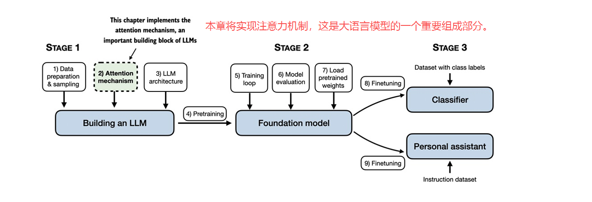

注意力机制是一个综合性话题，因此我们专门用一整章来讨论。我们将在很大程度上单独审视这些注意力机制，并专注于它们在机制层面的运作。在下一章，我们将编写围绕自注意力机制的LLM其余部分，以观察其实际效果，并创建一个能生成文本的模型。

在本章中，我们将实现四种不同变体的注意力机制，如图3.2所示。

**图3.2** 该图描述了本章将要编码的不同注意力机制，从简化版的自注意力开始，然后添加可训练权重。**因果注意力机制**在自注意力中添加了一个掩码，允许LLM一次生成一个词。最后，**多头注意力**将注意力机制组织成多个“头”，使模型能够并行捕捉输入数据的各个方面。

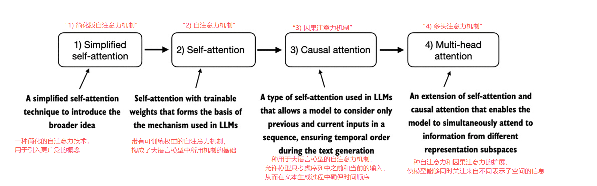

图3.2中所示的这些不同的注意力变体相互构建，目标是在本章结束时得到一个紧凑高效的多头注意力实现，然后我们可以将其插入到下一章将要编码的LLM架构中。

这段内容的中文翻译如下：

---

## 3.1 长序列建模的问题

在本章后续深入探讨大语言模型核心的自注意力机制之前，我们先来了解一下：在没有注意力机制的时代，那些早于LLM出现的架构存在什么问题？假设我们要开发一个语言翻译模型，将文本从一种语言翻译成另一种语言。如图3.3所示，由于源语言和目标语言的语法结构不同，我们无法简单地逐词翻译。

**图3.3** 将文本从一种语言翻译成另一种语言时（例如德语译成英语），无法仅仅通过逐词翻译完成。相反，翻译过程需要上下文理解和语法对齐。

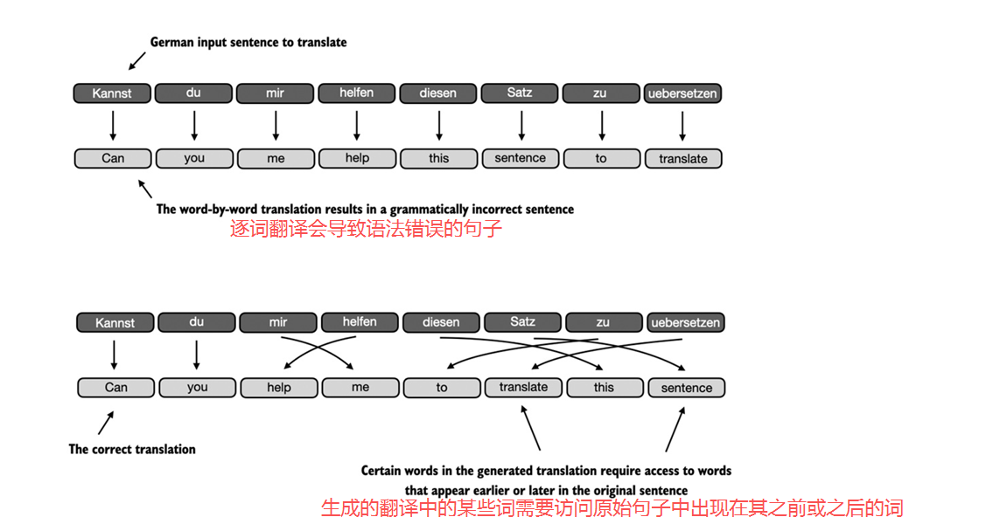

为了解决无法逐词翻译的问题，通常会使用一种包含两个子模块的深度神经网络，即所谓的编码器和解码器。编码器的任务是首先读取并处理整个文本，然后解码器生成翻译后的文本。

在第1章（1.4节“针对不同任务使用LLM”）介绍Transformer架构时，我们已经简要讨论过编码器-解码器网络。在Transformer出现之前，循环神经网络（RNN）是最流行的用于语言翻译的编码器-解码器架构。

RNN是一种神经网络，它将前一步的输出作为当前步的输入，因此非常适合处理像文本这样的序列数据。如果你不熟悉RNN也没关系，理解后续内容并不需要深入了解RNN的详细工作原理；我们这里更关注的是编码器-解码器架构的整体概念。

在编码器-解码器RNN中，输入文本被送入编码器，编码器对其进行顺序处理。如图3.4所示，编码器在每一步都会更新其隐藏状态（隐藏层中的内部值），并试图将输入句子的全部含义浓缩在最终的隐藏状态中。然后，解码器接收这个最终隐藏状态，开始逐词生成翻译后的句子。解码器在每一步也会更新自己的隐藏状态，该状态承载着预测下一个词所需的上下文信息。

**图3.4** 在Transformer模型出现之前，编码器-解码器RNN是机器翻译的常用选择。编码器接收源语言的token序列作为输入，编码器的隐藏状态（神经网络的中间层）对整个输入序列进行压缩表示。然后，解码器使用其当前隐藏状态开始逐词翻译。

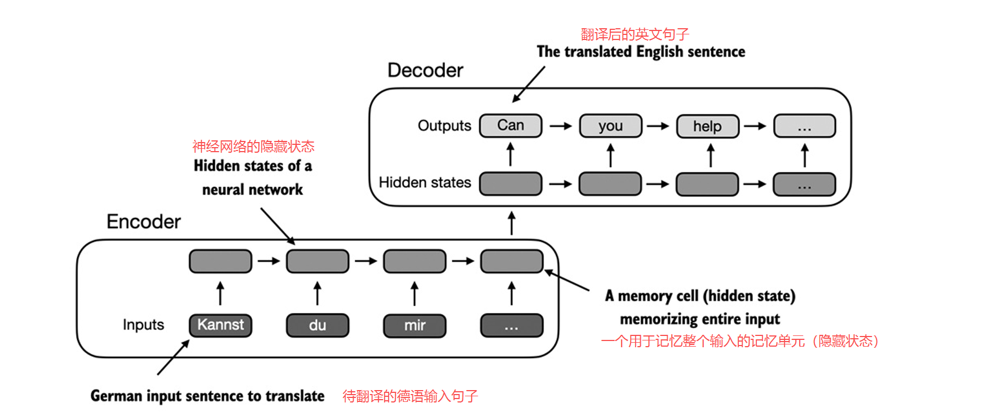

虽然我们不需要了解这些编码器-解码器RNN的内部工作原理，但关键思想在于：编码器部分将整个输入文本处理成一个隐藏状态（记忆单元）。然后解码器接收这个隐藏状态来生成输出。你可以把这个隐藏状态理解为我们在第2章讨论过的一种嵌入向量。

编码器-解码器RNN的一个主要问题和局限性在于：在解码阶段，RNN无法直接访问编码器早期的隐藏状态。因此，它只能依赖于当前隐藏状态（该状态应封装了所有相关信息）。这可能导致上下文信息的丢失，尤其是在处理长距离依赖的复杂句子时。

对于不熟悉RNN的读者来说，理解或深入研究这种架构并不是必要的，因为本书不会使用它。本节的要点是：编码器-解码器RNN存在一个缺陷，而这个缺陷正是促使注意力机制被设计出来的动因。

## 3.2 使用注意力机制捕获数据依赖关系

在Transformer LLM出现之前，RNN常用于语言建模任务，如之前提到的语言翻译。RNN对于翻译短句效果不错，但对于较长的文本效果不佳，因为它们无法直接访问输入中的先前词。

这种方法的一个主要缺点是，RNN在将编码后的输入传递给解码器之前，必须将其全部记忆在单一的隐藏状态中，如图3.4所示（见上一节）。

因此，研究人员在2014年为RNN开发了所谓的**Bahdanau注意力机制**（以相关论文第一作者的名字命名），它修改了编码器-解码器RNN，使得解码器在每一步解码时可以有选择地访问输入序列的不同部分，如图3.5所示。

**图3.5** 使用注意力机制后，网络中用于文本生成的解码器部分可以有选择地访问所有输入令牌。这意味着对于生成某个输出令牌而言，某些输入令牌比其他令牌更重要。这种重要性由所谓的**注意力权重**决定，我们稍后将计算它。请注意，此图展示了注意力背后的通用思想，并未描绘Bahdanau机制的确切实现，这是一种RNN方法，超出了本书的范围。

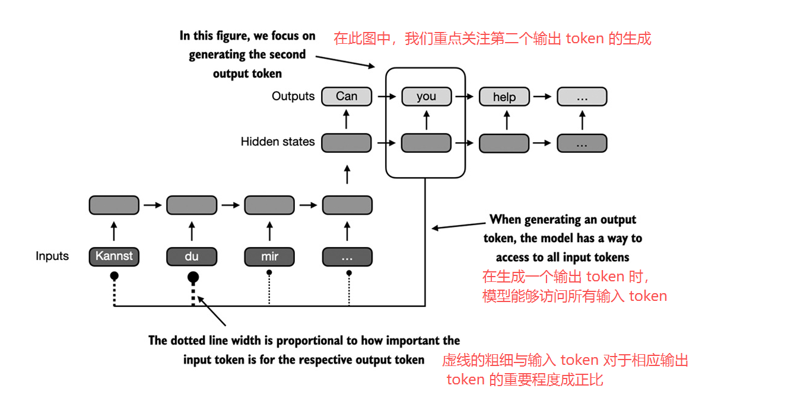

有趣的是，仅仅三年后，研究人员发现构建用于自然语言处理的深度神经网络并不需要RNN架构，并提出了最初的Transformer架构（在第1章中讨论过），其中包含了一种受Bahdanau注意力机制启发的**自注意力机制**。

**自注意力**是一种机制，允许输入序列中的每个位置在计算序列表示时，关注同一序列中的所有位置。自注意力是基于Transformer架构的当代LLM（如GPT系列）的关键组成部分。

本章重点在于编码和理解这种用于类GPT模型的自注意力机制，如图3.6所示。在下一章中，我们将编写LLM的其余部分。

**图3.6** 自注意力是Transformer中的一种机制，通过允许序列中的每个位置与同一序列中的所有其他位置交互并权衡其重要性，来计算更高效的输入表示。在本章中，我们将从头开始编写这个自注意力机制，然后在下一章编写类似GPT的LLM的其余部分。

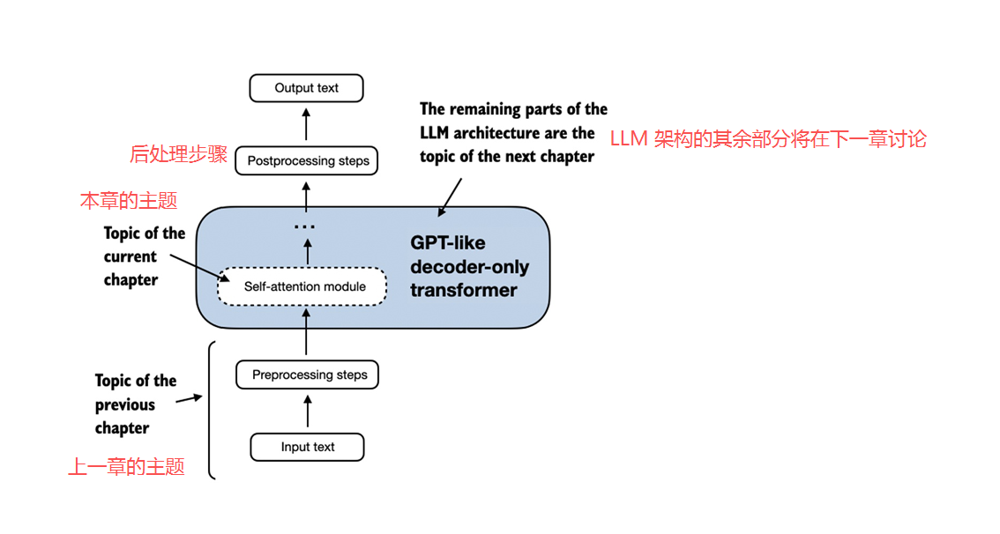

## 3.3 使用自注意力关注输入的不同部分

我们现在将深入研究自注意力机制的内部工作原理，并学习如何从头开始编写它。自注意力是每个基于Transformer架构的LLM的基石。值得注意的是，这个主题可能需要高度的专注和注意力（双关语，非有意为之），但一旦你掌握了它的基本原理，你就攻克了本书乃至实现LLM中最困难的部分之一。

**自注意力中的“自”**

在自注意力中，“自”指的是该机制能够通过关联单个输入序列中的不同位置来计算注意力权重。它评估并学习输入本身各部分（如句子中的词或图像中的像素）之间的关系和依赖。这与传统的注意力机制形成对比，后者关注的是两个不同序列元素之间的关系，例如在序列到序列模型中，注意力可能存在于输入序列和输出序列之间，如图3.5所示的例子。

由于自注意力可能显得复杂，尤其是如果你第一次接触它，我们将在下一小节先介绍一个简化版的自注意力。之后，在3.4节中，我们将实现LLM中使用的带有可训练权重的自注意力机制。

## 3.3.1 一个简单的无训练权重的自注意力机制

在本节中，我们将实现一个简化的自注意力变体，没有任何可训练的权重，如图3.7所示。本节的目的是在下一节3.4中添加可训练权重之前，先说明自注意力中的几个关键概念。

**图3.7** 自注意力的目标是为每个输入元素计算一个**上下文向量**，该向量整合了来自所有其他输入元素的信息。在此图所示的示例中，我们计算上下文向量 \( z^{(2)} \)。在计算 \( z^{(2)} \) 时，每个输入元素的重要性或贡献由注意力权重 \( \alpha_{21} \) 到 \( \alpha_{2T} \) 决定。这些注意力权重的具体计算将在本节后面讨论。

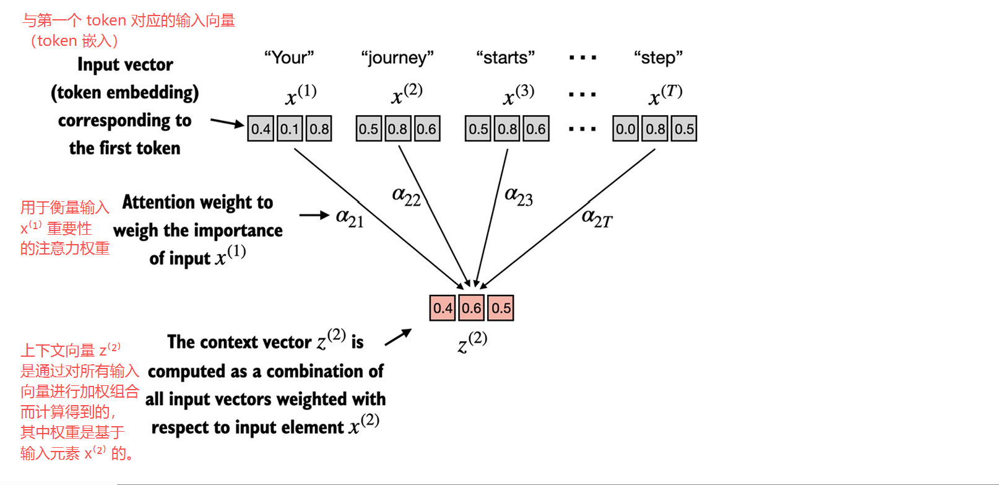


图3.7显示了一个输入序列，记为 \( x \)，由 \( T \) 个元素组成，表示为 \( x^{(1)} \) 到 \( x^{(T)} \)。该序列通常表示文本，例如一个句子，并且已经转换为令牌嵌入，如第2章所述。

例如，考虑像“Your journey starts with one step.”这样的输入文本。在这种情况下，序列的每个元素（例如 \( x^{(1)} \)）对应一个 \( d \) 维嵌入向量，表示一个特定的令牌，例如“Your”。在图3.7中，这些输入向量被显示为3维嵌入。

在自注意力中，我们的目标是为输入序列中的每个元素 \( x^{(i)} \) 计算上下文向量 \( z^{(i)} \)。上下文向量可以解释为**增强的嵌入向量**。

为了说明这个概念，让我们关注第二个输入元素 \( x^{(2)} \)（对应令牌“journey”）的嵌入向量，以及图3.7底部显示的相应上下文向量 \( z^{(2)} \)。这个增强的上下文向量 \( z^{(2)} \) 是一个嵌入，其中包含关于 \( x^{(2)} \) 和所有其他输入元素 \( x^{(1)} \) 到 \( x^{(T)} \) 的信息。

在自注意力中，上下文向量起着至关重要的作用。它们的目标是通过整合序列中所有其他元素的信息，为输入序列（如句子）中的每个元素创建增强的表示，如图3.7所示。这对于需要理解句子中单词之间关系和相关性的LLM至关重要。稍后，我们将添加可训练权重，帮助LLM学习构建这些上下文向量，使其对LLM生成下一个令牌具有相关性。

在本节中，我们将实现一个简化的自注意力机制，逐步计算这些权重和由此产生的上下文向量。

考虑以下输入句子，它已经被嵌入为3维向量，如第2章所述。为了说明起见，我们选择一个小的嵌入维度，以确保它能在页面上完整显示而不换行：
```python
import torch

inputs = torch.tensor(
  [[0.43, 0.15, 0.89], # Your     (x^1)
   [0.55, 0.87, 0.66], # journey  (x^2)
   [0.57, 0.85, 0.64], # starts   (x^3)
   [0.22, 0.58, 0.33], # with     (x^4)
   [0.77, 0.25, 0.10], # one      (x^5)
   [0.05, 0.80, 0.55]] # step     (x^6)
)
```
实现自注意力的第一步是计算中间值 \( \omega \)，称为**注意力分数**，如图3.8所示。

**图3.8** 本节的主要目标是说明使用第二个输入序列 \( x^{(2)} \) 作为查询来计算上下文向量 \( z^{(2)} \) 的过程。此图显示了第一个中间步骤：计算查询 \( x^{(2)} \) 与所有其他输入元素之间的注意力分数 \( \omega \)（作为点积）。（请注意，图中的数字被截断到小数点后一位，以减少视觉杂乱。）

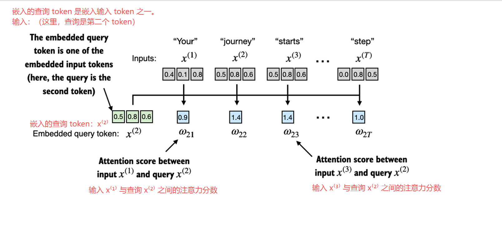

图3.8说明了我们如何计算查询令牌与每个输入令牌之间的中间注意力分数。我们通过计算查询 \( x^{(2)} \) 与每个其他输入令牌的点积来确定这些分数：
```python
query = inputs[1]  #A
attn_scores_2 = torch.empty(inputs.shape[0])
for i, x_i in enumerate(inputs):
    attn_scores_2[i] = torch.dot(x_i, query)
print(attn_scores_2)
```
计算出的注意力分数如下：
```
tensor([0.9544, 1.4950, 1.4754, 0.8434, 0.7070, 1.0865])
```

> **理解点积**
> 点积本质上只是一种将两个向量按元素相乘然后求和乘积的简洁方式，我们可以如下演示：
> ```python
> res = 0.
> for idx, element in enumerate(inputs[0]):
>     res += inputs[0][idx] * query[idx]
> print(res)
> print(torch.dot(inputs[0], query))
> ```
> 输出结果证实了元素级乘积的和与点积结果相同：
> ```
> tensor(0.9544)
> tensor(0.9544)
> ```
> 除了将点积运算视为一种结合两个向量以产生标量值的数学工具之外，点积也是一种**相似性度量**，因为它量化了两个向量的对齐程度：点积越高，表示向量之间的对齐度或相似度越高。在自注意力机制的背景下，点积决定了序列中元素相互关注的程度：点积越高，两个元素之间的相似性和注意力分数就越高。

下一步，如图3.9所示，我们对之前计算的每个注意力分数进行**归一化**。

**图3.9** 在计算了与输入查询 \( x^{(2)} \) 相关的注意力分数 \( \omega_{21} \) 到 \( \omega_{2T} \) 之后，下一步是通过归一化注意力分数来获得注意力权重 \( \alpha_{21} \) 到 \( \alpha_{2T} \)。

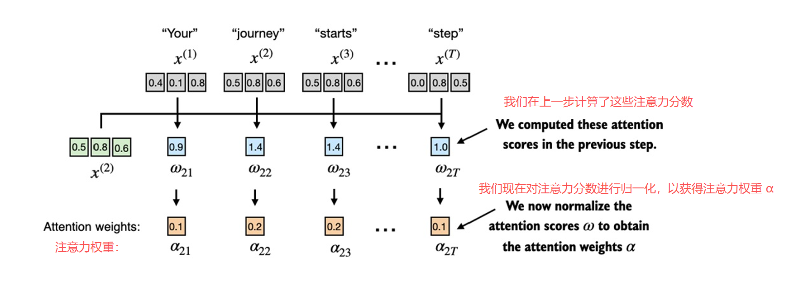

图3.9所示归一化的主要目标是获得**总和为1的注意力权重**。这种归一化是一种约定，有助于解释和在LLM中维持训练稳定性。

以下是实现此归一化步骤的直接方法：
```python
attn_weights_2_tmp = attn_scores_2 / attn_scores_2.sum()
print("Attention weights:", attn_weights_2_tmp)
print("Sum:", attn_weights_2_tmp.sum())
```
如输出所示，注意力权重现在总和为1：
```
Attention weights: tensor([0.1455, 0.2278, 0.2249, 0.1285, 0.1077, 0.1656])
Sum: tensor(1.0000)
```

在实践中，更常见且推荐使用 **softmax** 函数进行归一化。这种方法在处理极值方面更好，并且在训练期间提供更有利的梯度特性。下面是一个用于归一化注意力分数的softmax函数的基本实现：
```python
def softmax_naive(x):
    return torch.exp(x) / torch.exp(x).sum(dim=0)

attn_weights_2_naive = softmax_naive(attn_scores_2)
print("Attention weights:", attn_weights_2_naive)
print("Sum:", attn_weights_2_naive.sum())
```
如输出所示，softmax函数也满足了目标，将注意力权重归一化，使其总和为1：
```
Attention weights: tensor([0.1385, 0.2379, 0.2333, 0.1240, 0.1082, 0.1581])
Sum: tensor(1.)
```
此外，softmax函数确保了注意力权重始终为正。这使得输出可以解释为**概率或相对重要性**，其中权重越高表示重要性越大。

请注意，这个朴素的softmax实现 (`softmax_naive`) 在处理非常大或非常小的输入值时可能会遇到数值稳定性问题，例如溢出和下溢。因此，在实践中，建议使用经过性能优化的PyTorch softmax实现：
```python
attn_weights_2 = torch.softmax(attn_scores_2, dim=0)
print("Attention weights:", attn_weights_2)
print("Sum:", attn_weights_2.sum())
```
在这种情况下，我们可以看到它产生了与我们之前的 `softmax_naive` 函数相同的结果：
```
Attention weights: tensor([0.1385, 0.2379, 0.2333, 0.1240, 0.1082, 0.1581])
Sum: tensor(1.)
```

现在我们计算了归一化的注意力权重，我们准备好进行如图3.10所示的最后一步：通过将嵌入的输入令牌 \( x^{(i)} \) 与相应的注意力权重相乘，然后对结果向量求和，来计算上下文向量 \( z^{(2)} \)。

**图3.10** 在计算和归一化注意力分数以获得查询 \( x^{(2)} \) 的注意力权重之后的最后一步是计算上下文向量 \( z^{(2)} \)。这个上下文向量是所有输入向量 \( x^{(1)} \) 到 \( x^{(T)} \) 按注意力权重加权的组合。

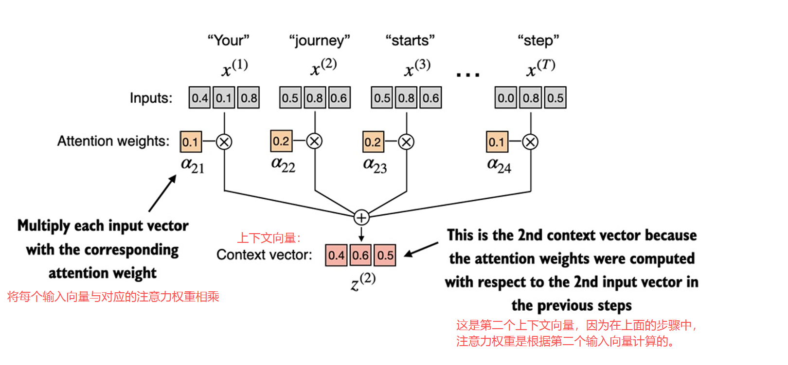

图3.10中描绘的上下文向量 \( z^{(2)} \) 被计算为所有输入向量的**加权和**。这涉及将每个输入向量乘以其对应的注意力权重：
```python
query = inputs[1]  # 第二个输入令牌是查询
context_vec_2 = torch.zeros(query.shape)
for i, x_i in enumerate(inputs):
    context_vec_2 += attn_weights_2[i] * x_i
print(context_vec_2)
```
该计算的结果如下：
```
tensor([0.4419, 0.6515, 0.5683])
```

在下一节中，我们将推广这个计算上下文向量的过程，以**同时计算所有上下文向量**。

## 3.3.2 计算所有输入令牌的注意力权重

在上一节中，我们计算了输入2的注意力权重和上下文向量，如图3.11中高亮显示的行所示。现在，我们将扩展此计算，以计算所有输入的注意力权重和上下文向量。

**图3.11** 高亮行显示了我们在上一节中计算的、以第二个输入元素为查询的注意力权重。本节将泛化计算以获得所有其他注意力权重。

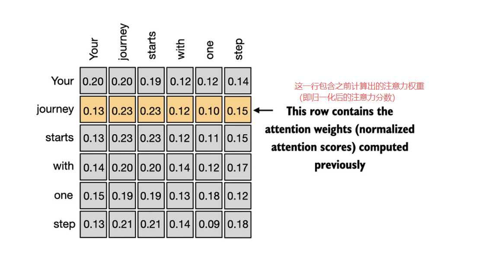

我们遵循与之前相同的三个步骤，如图3.12所示，只是在代码中进行了一些修改，以计算所有上下文向量，而不仅仅是第二个上下文向量 \( z^{(2)} \)。

**图3.12**

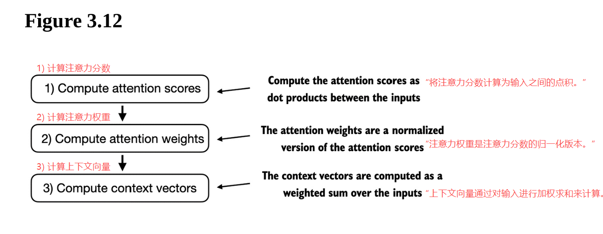

首先，在如图3.12所示的**步骤1**中，我们添加一个额外的for循环来计算所有输入对之间的点积：
```python
attn_scores = torch.empty(6, 6)
for i, x_i in enumerate(inputs):
    for j, x_j in enumerate(inputs):
        attn_scores[i, j] = torch.dot(x_i, x_j)
print(attn_scores)
```
得到的注意力分数如下：
```
tensor([[0.9995, 0.9544, 0.9422, 0.4753, 0.4576, 0.6310],
        [0.9544, 1.4950, 1.4754, 0.8434, 0.7070, 1.0865],
        [0.9422, 1.4754, 1.4570, 0.8296, 0.7154, 1.0605],
        [0.4753, 0.8434, 0.8296, 0.4937, 0.3474, 0.6565],
        [0.4576, 0.7070, 0.7154, 0.3474, 0.6654, 0.2935],
        [0.6310, 1.0865, 1.0605, 0.6565, 0.2935, 0.9450]])
```
上述张量中的每个元素代表每对输入之间的注意力分数，如图3.11所示。请注意，图3.11中的值是归一化后的，这就是它们与上述张量中未归一化的注意力分数不同的原因。我们稍后会处理归一化。

在计算上述注意力分数张量时，我们使用了Python中的for循环。然而，for循环通常很慢，我们可以使用**矩阵乘法**达到相同的结果：
```python
attn_scores = inputs @ inputs.T
print(attn_scores)
```
我们可以直观地确认结果与之前相同：
```
tensor([[0.9995, 0.9544, 0.9422, 0.4753, 0.4576, 0.6310],
        [0.9544, 1.4950, 1.4754, 0.8434, 0.7070, 1.0865],
        [0.9422, 1.4754, 1.4570, 0.8296, 0.7154, 1.0605],
        [0.4753, 0.8434, 0.8296, 0.4937, 0.3474, 0.6565],
        [0.4576, 0.7070, 0.7154, 0.3474, 0.6654, 0.2935],
        [0.6310, 1.0865, 1.0605, 0.6565, 0.2935, 0.9450]])
```

在如图3.12所示的**步骤2**中，我们现在归一化每一行，使得每一行中的值之和为1：
```python
attn_weights = torch.softmax(attn_scores, dim=1)
print(attn_weights)
```
这返回以下注意力权重张量，其值与图3.10中显示的值相匹配：
```
tensor([[0.2098, 0.2006, 0.1981, 0.1242, 0.1220, 0.1452],
        [0.1385, 0.2379, 0.2333, 0.1240, 0.1082, 0.1581],
        [0.1390, 0.2369, 0.2326, 0.1242, 0.1108, 0.1565],
        [0.1435, 0.2074, 0.2046, 0.1462, 0.1263, 0.1720],
        [0.1526, 0.1958, 0.1975, 0.1367, 0.1879, 0.1295],
        [0.1385, 0.2184, 0.2128, 0.1420, 0.0988, 0.1896]])
```
在我们继续**步骤3**（图3.12所示的最后一步）之前，让我们简要验证一下各行确实总和为1：
```python
row_2_sum = sum([0.1385, 0.2379, 0.2333, 0.1240, 0.1082, 0.1581])
print("Row 2 sum:", row_2_sum)
print("All row sums:", attn_weights.sum(dim=1))
```
结果如下：
```
Row 2 sum: 1.0
All row sums: tensor([1.0000, 1.0000, 1.0000, 1.0000, 1.0000, 1.0000])
```

在第三也是最后一步中，我们现在使用这些注意力权重通过**矩阵乘法**计算所有上下文向量：
```python
all_context_vecs = attn_weights @ inputs
print(all_context_vecs)
```
在结果输出张量中，每一行包含一个3维上下文向量：
```
tensor([[0.4421, 0.5931, 0.5790],
        [0.4419, 0.6515, 0.5683],
        [0.4431, 0.6496, 0.5671],
        [0.4304, 0.6298, 0.5510],
        [0.4671, 0.5910, 0.5266],
        [0.4177, 0.6503, 0.5645]])
```

我们可以通过将第2行与我们之前在3.3.1节中计算的上下文向量 \( z^{(2)} \) 进行比较来验证代码的正确性：
```python
print("Previous 2nd context vector:", context_vec_2)
```
根据结果，我们可以看到先前计算的 `context_vec_2` 与上述张量中的第二行完全匹配：
```
Previous 2nd context vector: tensor([0.4419, 0.6515, 0.5683])
```

至此，我们完成了一个简单自注意力机制的代码讲解。在下一节中，我们将添加**可训练的权重**，使LLM能够从数据中学习并提高其在特定任务上的性能。
